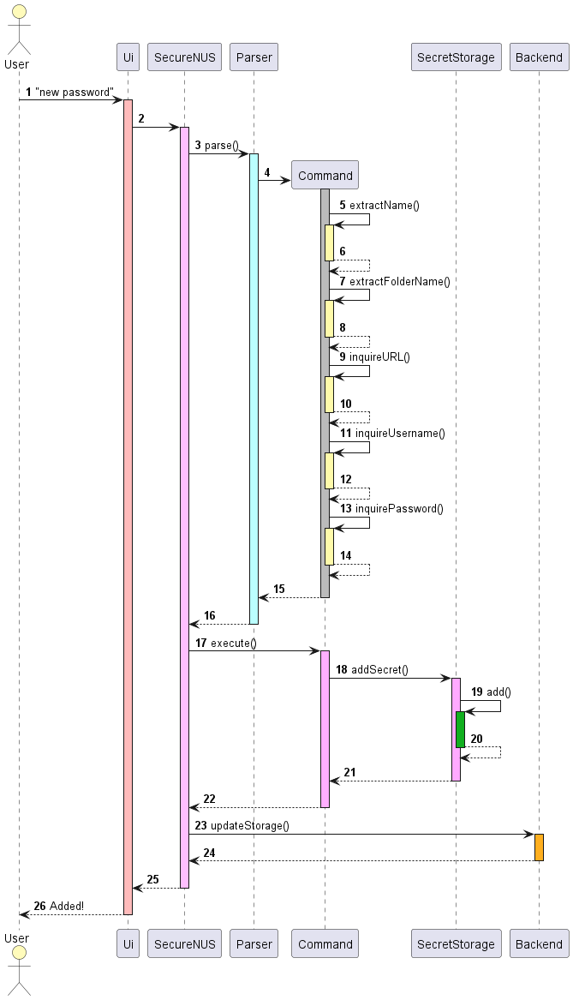
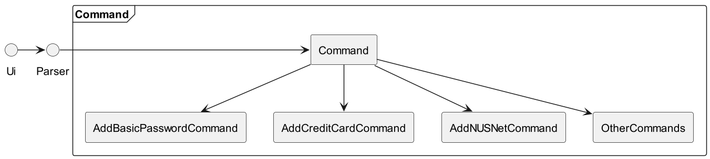

[//]: # (@@author DeepanjaliDhawan)
# Developer Guide

---

# Acknowledgements

## [AddressBook Template](https://se-education.org/addressbook-level3/DeveloperGuide.html#proposed-undoredo-feature)

The format of this Developer’s guide (DG) as well as some basic support is inspired/ taken from the AddressBook 
project’s DG.

## [Bitwarden](https://go.bitwarden.com/password-management-for-business-teams-organizations/?utm_source=google&utm_medium=cpc&utm_campaign=AW_APAC_NU_CL_Bitwarden_en_GSN_DTMB_Brand_KW:Brand_Exact&utm_content=646898599878&utm_term=bitwarden&hsa_acc=2567950947&hsa_cam=11319090405&hsa_grp=114652450007&hsa_ad=646898599878&hsa_src=g&hsa_tgt=kwd-442029814536&hsa_kw=bitwarden&hsa_mt=b&hsa_net=adwords&hsa_ver=3&gclid=CjwKCAjwzuqgBhAcEiwAdj5dRn0X9IDtuPlHiXveE0H8FMOOYNtwMBxX7lUL4yzK8zUTKH_58EV-4xoCrVkQAvD_BwE)

The idea for this product stems out from Applications like Bitwarden and the like that serve to store and protect users passwords. Many of our features were inspired by these applications.

## CLI Applications

The idea for this product is for users who are familiar with CLI environments. Users are able to see only the necessary information given in text format. Things can be done faster with just a single line of input command compared to navigating through a GUI environment.

---

# Setting up, getting started

## Setting up the project in your computer

First, fork this repo, and clone the fork into your computer.

If you plan to use Intellij IDEA (highly recommended):

1. **Configure the JDK:** Follow the guide [[se-edu/guides] IDEA: Configuring the JDK](https://se-education.org/guides/tutorials/intellijJdk.html) to ensure Intellij is configured to use JDK 11.
2. **Import the project as a Gradle project:** Follow the guide [[se-edu/guides] IDEA: Importing a Gradle project](https://se-education.org/guides/tutorials/intellijImportGradleProject.html) to import the project into IDEA. \

Note: Importing a Gradle project is slightly different from importing a normal Java project.
3. **Verify the setup:**
    1. Run the _seedu.address.Main_ and try a few commands.
    2. [Run the tests](https://se-education.org/addressbook-level3/Testing.html) to ensure they all pass.

## Before writing code

1. **Configure the coding style** \
   If using IDEA, follow the guide [[se-edu/guides] IDEA: Configuring the code style](https://se-education.org/guides/tutorials/intellijCodeStyle.html) to set up IDEA’s coding style to match ours. 

Tip: Optionally, you can follow the guide [[se-edu/guides] Using Checkstyle](https://se-education.org/guides/tutorials/checkstyle.html) to find how to use the CheckStyle within IDEA e.g., to report problems as you write code.  

2. **Set up CI** This project comes with a GitHub Actions config files (in .github/workflows folder). When GitHub detects those files, it will run the CI for your project automatically at each push to the master branch or to any PR. No set up required.  
3. **Learn the design** When you are ready to start coding, we recommend that you get some sense of the overall design by reading about [AddressBook’s architecture](https://se-education.org/addressbook-level3/DeveloperGuide.html#architecture).  
4. **Do the tutorials These tutorials will help you get acquainted with the codebase.**  
    * [Tracing code](https://se-education.org/addressbook-level3/tutorials/TracingCode.html)
    * [Adding a new command](https://se-education.org/addressbook-level3/tutorials/AddRemark.html)
    * [Removing fields](https://se-education.org/addressbook-level3/tutorials/RemovingFields.html)

---

[//]: # (@@author ollayf)
# Design & Implementation

## Architecture

This **Architecture Diagram** explains the high-level design of the App.

### Main Components of the architecture

**SecureNUS** has 1 class called SecureNUS. It is responsible for,
* At app launch: initializing all the important components in the correct sequence and initializes the appropriate connections between them.
* It connects and sends the appropriate information and executes different actions using the other helpers via **Commands**.

**SecretStorage** is responsible for the management of Secret Objects which store information of different Secret classes, e.g. passwords, credit cards. It also manages the different underlying data structures within it that help optimize the speed of queries through indexing, etc. It consists of 3 classes: **SecretMaster, SecretSearcher** and **SecretEnumerator**, which contain the different views.

* **SecretMaster:** Manages the other views and also ensures there are no duplicates in naming where they should not exist
* **SecretSearcher:** Contains the Hashtable view for directly querying the Secret by name
* **SecretEnumerator:** Contains the ArrayList view for querying the Secret by index

The other 2 components are:

* **UI:** The main interface the user have access to through the Command Line
* **Backend:** Which handles the details regarding the initialisation and saving (or exporting) of data across sessions

  

___
### How the architecture components interact with each other

The Sequence Diagram below shows how the components interact with each other for the scenario where the user creates a new basic password initiated using the command `new password.`

Sequence Diagram

Each of the six main components (also shown in the diagram above)

* defines its API in an interface with the same name as the Component.

## UI Component

The API of this component is specified in `Ui.java`

The UI consists of the Ui class which handles all the inputs provided by the user. The Ui then sends information to the 
parser which will interpret the commands provided by user input. The **Parser **will create **Commands** which will be
sent to **SecureNUS** to execute some command that will alter the data in SecretStorage. The **Ui **also handles 
responses/ feedback to the User.

## SecureNUS Component

This is the main component that initialises all other components and connects them when the application is running.

## SecretStorage Component

The Secret Storage component abstracts the data that is to be stored into many views/ indexes. This optimizes the speed of queries for many types of queries without developers needing to access the individual data structures used. The data structures, namely Hash Table and Array are stored in the SecretSearcher and SecretEnumerator class respectively. Finally, during the initialisation of the application, the Backend will connect past data to the SecretMaster. During shutdown, the Backend will handle saving it into an encrypted file.

[//]: # (@@author stevenantya)
## Command Component

The API of this component is specified in Command.java

Command is an abstract class that is inherited by various components such as AddBasicPasswordCommand.java

The Command consist of Command abstract class that handles all of its command constructors and executions through its child classes. The user inputs command in Ui, that is parsed in Parser, and then instantiated and executed in Command classes.

## Backend Component

The backend manages the saving and loading of data from the database.txt file. To do so, it collates and organises information stored in the SecretMaster and encrypts it into the database.txt. When starting up, it will decrypt the database.txt file and transfer its data into the SecretMaster.

---

[//]: # (@@author euzhengxi)
# Product Scope

## Target user profile:

* has a need to manage a significant number of passwords
* prefer desktop apps over other types
* can type fast
* prefers typing to mouse interactions
* is reasonably comfortable using CLI apps

## Value proposition:
* SecureNUS manages passwords faster than a typical mouse/GUI-driven password manager app.
* SecureNUS manages and stores passwords locally, there is no risk of a server side failure/ attack leaking your passwords

---

[//]: # (@@author kairuler)
# User Stories

<table>
  <tr>
   <td><strong>Version</strong>
   </td>
   <td><strong>As a …</strong>
   </td>
   <td><strong>I want to …</strong>
   </td>
   <td><strong>So that I can …</strong>
   </td>
  </tr>
  <tr>
   <td>v1.0
   </td>
   <td>user
   </td>
   <td>view all my passwords in a single location
   </td>
   <td>have an overview of all my stored passwords
   </td>
  </tr>
  <tr>
   <td>v1.0
   </td>
   <td>user
   </td>
   <td>store and find my passwords in an intuitive and structured manner
   </td>
   <td>easily find a password
   </td>
  </tr>
  <tr>
   <td>v1.0
   </td>
   <td>user
   </td>
   <td>view all my stored passwords at a glance (without details)
   </td>
   <td>quickly see what passwords I have used before
   </td>
  </tr>
  <tr>
   <td>v1.0
   </td>
   <td>user
   </td>
   <td>delete stored passwords
   </td>
   <td>remove passwords that I no longer use
   </td>
  </tr>
  <tr>
   <td>v1.0
   </td>
   <td>user
   </td>
   <td>add and store passwords
   </td>
   <td>
   </td>
  </tr>
  <tr>
   <td>v1.0
   </td>
   <td>user
   </td>
   <td>ensure my stored passwords are safe
   </td>
   <td>not have to worry about the security of my passwords after storing them
   </td>
  </tr>
  <tr>
   <td>v1.0
   </td>
   <td>user
   </td>
   <td>use local storage to store my passwords
   </td>
   <td>have my passwords stored locally so that they are safer from online breaches
   </td>
  </tr>
  <tr>
   <td>v1.0
   </td>
   <td>user
   </td>
   <td>hide my password while typing it
   </td>
   <td>not allow people around me to view my password as I type
   </td>
  </tr>
  <tr>
   <td>v2.0
   </td>
   <td>user
   </td>
   <td>authenticate myself before accessing
   </td>
   <td>ensure that nobody else but me gets access to my stored passwords
   </td>
  </tr>
  <tr>
   <td>v2.0
   </td>
   <td>first-time user
   </td>
   <td>want to be able to see the demo to use the password manager
   </td>
   <td>learn how to use SecureNUS
   </td>
  </tr>
  <tr>
   <td>v2.0
   </td>
   <td>user
   </td>
   <td>receive notification any of my previous passwords are reused
   </td>
   <td>use a new and different password each time
   </td>
  </tr>
  <tr>
   <td>v2.0
   </td>
   <td>user
   </td>
   <td>know when I created a certain password
   </td>
   <td>keep track of how long my passwords have been used for
   </td>
  </tr>
  <tr>
   <td>v2.0
   </td>
   <td>user
   </td>
   <td>not have to think of a strong password by myself and let the app handle it
   </td>
   <td>know when to change my password as passwords should be changed periodically
   </td>
  </tr>
  <tr>
   <td>v2.0
   </td>
   <td>user
   </td>
   <td>receive reminder to change passwords that have not been changed for an extended period of time
   </td>
   <td>not have to check every single password manually (but still have the ability to) to know when to change my passwords
   </td>
  </tr>
  <tr>
   <td>v2.0
   </td>
   <td>user
   </td>
   <td>select a particular stored password and expand it to reveal details
   </td>
   <td>use the details of the password to make decisions regarding the password (e.g. change the password if it has been used for a long time, create a stronger password the next time if the current one is not strong, etc.)
   </td>
  </tr>
  <tr>
   <td>v2.0
   </td>
   <td>user
   </td>
   <td>copy and paste my passwords
   </td>
   <td>not have to type my password, just simply copy paste
   </td>
  </tr>
  <tr>
   <td>v2.0
   </td>
   <td>user
   </td>
   <td>search/filter out specific passwords
   </td>
   <td>quickly refer to a password that is used for a specific login (e.g. password for NUS email)
   </td>
  </tr>
  <tr>
   <td>v2.0
   </td>
   <td>user who wishes to use complex passwords
   </td>
   <td>generate complex passwords for me
   </td>
   <td>not have to think of a strong password by myself and let the app handle it
   </td>
  </tr>
  <tr>
   <td>v2.0
   </td>
   <td>user
   </td>
   <td>sync my stored passwords manually
   </td>
   <td>have my stored passwords on different devices
   </td>
  </tr>
  <tr>
   <td>v2.0
   </td>
   <td>user
   </td>
   <td>encrypt the password.txt file
   </td>
   <td>ensure that nobody but me has access to the .txt file that stores my passwords
   </td>
  </tr>
</table>

---

# Non-Functional Requirements

* Should be responsive and fast, providing quick access to passwords and other information with just one or two commands.
* Should be user-friendly, with intuitive commands that makes it easy for users to create, store, and retrieve passwords.
* Should be compatible with various operating systems as long as Java 11 or above is installed.
* Should be reliable and operational all the time with little-to-no bugs or errors.
* Should be able to store at least 1000 passwords without compromising performance or security.
* Should be maintainable, with a clear and well-documented codebase that makes it easy to fix bugs and add new features.
* Must ensure that user data is not shared with third parties without user consent.
* Should be secure, using strong encryption to protect user passwords and data from being hacked or stolen.

---

# Glossary

* { _glossary item_ - Definition }

---

# Instructions for manual testing

_{Give instructions on how to do a manual product testing e.g., how to load sample data to be used for testing}_
