[//]: # (@@author DeepanjaliDhawan)
# Developer Guide
- [Acknowledgements](#acknowledgements)
- [Setting up, getting started](#setting-up-getting-started)
- [Design](#design)
  - [Legend](#legend)
  - [Architecture](#architecture)
  - [SecureNUS Component](#securenus-component)
  - [SecretStorage Component](#secretstorage-component)
  - [Backend component](#backend-component)
  - [UI component](#ui-component)
- [Implementation](#implementation)
  - [Add Basic Password](#add-basic-password)
  - [Delete a Password](#delete-a-password)
  - [List all Secrets](#list-all-secrets)
- [Appendix: Requirements](#appendix-requirements)
  - [Product Scope](#product-scope)
  - [User Stories](#user-stories)
  - [Non-Functional Requirements](#non-functional-requirements)
  - [Glossary](#glossary)
- [Appendix: Instructions for manual testing](#appendix-instructions-for-manual-testing)
  - [Launch and shutdown](#launch-and-shutdown)
  - [Saving data](#saving-data)
  - [Menu of all Commands](#menu-of-all-commands)
  - [Adding a Password](#adding-a-password)
  - [Listing all Passwords](#listing-all-passwords)
  - [Search for a password](#search-for-password)
  - [View Password](#view-password)
  - [Edit Password](#edit-password)
  - [Deleting Password](#delete-password)

---

## Acknowledgements


### [AddressBook Template](https://se-education.org/addressbook-level3/DeveloperGuide.html#proposed-undoredo-feature)

The format of this Developer’s guide (DG) as well as some basic support is inspired/ taken from the AddressBook 
project’s DG.


### [Bitwarden](https://go.bitwarden.com/password-management-for-business-teams-organizations/?utm_source=google&utm_medium=cpc&utm_campaign=AW_APAC_NU_CL_Bitwarden_en_GSN_DTMB_Brand_KW:Brand_Exact&utm_content=646898599878&utm_term=bitwarden&hsa_acc=2567950947&hsa_cam=11319090405&hsa_grp=114652450007&hsa_ad=646898599878&hsa_src=g&hsa_tgt=kwd-442029814536&hsa_kw=bitwarden&hsa_mt=b&hsa_net=adwords&hsa_ver=3&gclid=CjwKCAjwzuqgBhAcEiwAdj5dRn0X9IDtuPlHiXveE0H8FMOOYNtwMBxX7lUL4yzK8zUTKH_58EV-4xoCrVkQAvD_BwE)

The idea for this product stems out from Applications like Bitwarden and the like that serve to store and protect users passwords. Many of our features were inspired by these applications.


### CLI Applications

The idea for this product is for users who are familiar with CLI environments. Users are able to see only the necessary information given in text format. Things can be done faster with just a single line of input command compared to navigating through a GUI environment.

<table>
    <tr>
        <td> <a href="#developer-guide">Back to Table of Contents </a> </td>
    </tr>
</table>

---


## Setting up, getting started


### Setting up the project in your computer

First, fork this repo, and clone the fork into your computer.

If you plan to use Intellij IDEA (highly recommended):


1. **Configure the JDK:** Follow the guide [[se-edu/guides] IDEA: Configuring the JDK](https://se-education.org/guides/tutorials/intellijJdk.html) to ensure Intellij is configured to use JDK 11.
2. **Import the project as a Gradle project:** Follow the guide [[se-edu/guides] IDEA: Importing a Gradle project](https://se-education.org/guides/tutorials/intellijImportGradleProject.html) to import the project into IDEA. \


Note: Importing a Gradle project is slightly different from importing a normal Java project.
3. **Verify the setup:**
    1. Run the _seedu.address.Main_ and try a few commands.
    2. [Run the tests](https://se-education.org/addressbook-level3/Testing.html) to ensure they all pass.


### Before writing code

1. **Configure the coding style** \
   If using IDEA, follow the guide [[se-edu/guides] IDEA: Configuring the code style](https://se-education.org/guides/tutorials/intellijCodeStyle.html) to set up IDEA’s coding style to match ours. 


Tip: Optionally, you can follow the guide [[se-edu/guides] Using Checkstyle](https://se-education.org/guides/tutorials/checkstyle.html) to find how to use the CheckStyle within IDEA e.g., to report problems as you write code.  

2. **Set up CI** This project comes with a GitHub Actions config files (in .github/workflows folder). When GitHub detects those files, it will run the CI for your project automatically at each push to the master branch or to any PR. No set up required.  
3. **Learn the design** When you are ready to start coding, we recommend that you get some sense of the overall design by reading about [AddressBook’s architecture](https://se-education.org/addressbook-level3/DeveloperGuide.html#architecture).  
4. **Do the tutorials These tutorials will help you get acquainted with the codebase.**  
    * [Tracing code](https://se-education.org/addressbook-level3/tutorials/TracingCode.html)
    * [Adding a new command](https://se-education.org/addressbook-level3/tutorials/AddRemark.html)
    * [Removing fields](https://se-education.org/addressbook-level3/tutorials/RemovingFields.html)

<table>
    <tr>
        <td> <a href="#developer-guide">Back to Table of Contents </a> </td>
    </tr>
</table>

---

[//]: # (@@author ollayf)


## Design
### Legend

The class diagram visibility / access modifier is represented by the table below
  
### Architecture


This **Architecture Diagram** explains the high-level design of the App.
Given below is the quick overview of main components and how they interact with each other.

#### Main Components of the architecture

**SecureNUS** has 1 class called SecureNUS. It is responsible for,
* At app launch: initializing all the important components in the correct sequence and initializes the appropriate connections between them.
* At Termination: Exports the current sessions into an output file through the backend component. It also disconnects the connections accordingly and frees up memory back to the OS.
* Generally, the SecureNUS component is the only component with direct read and write access to the data, which is stored in the SecretStorage component. So, it connects and sends the appropriate information and executes different actions using the other components when required.

**SecretStorage** is responsible for the management of Secret Objects which store 
information of different Secret classes, e.g. passwords, credit cards. 
It also manages the different underlying data structures within it that 
help optimize the speed of queries through indexing, etc. It consists of 
3 classes: **SecretMaster**, **SecretSearcher** and **SecretEnumerator**, which contain the different views.


* **SecretMaster:** Is the interface to be used to handle data. The SecretMaster Manages the other views and also ensures there are no duplicates in naming where they should not exist.
* **SecretSearcher:** Contains the Hashtable view for directly querying the Secret by name
* **SecretEnumerator:** Contains the ArrayList view for querying the Secret by index


**UI** is the main interface the user has access to through the Command Line with the 
application. All the information inputs are received by the UI. It also determines 
what action to make, such as in altering the data in the storage or providing some 
form of information (e.g. their secrets) to the user. These actions are defined by 
**Command** classes in the SecureNUS component to be executed. The **UI** Component 
also determines how responses are being formatted to the users for better readability 
and understandability.

**Backend** handles the details regarding the initialisation (importing) and saving 
(exporting) of data across sessions. At initialisation, it will be used by **SecureNUS** 
component to set up the **SecretStorage** by decrypting the database output files from 
previous sessions. It deals with the encryption and export of the data during the 
termination of the app.

**Logger** is the main component used for logging of issues and logging of states that 
arise in the execution of the application. It is used to allow developers to have 
a better understanding of why certain functions may fail, provide an unexpected 
outcome or experience an unexpected action. In the event of a failure when used by 
users, the logs store the state of the application reached by the user to serve as 
a form of bug report that users may submit as an issue to be solved by developers, 
in the case of an unexpected issue. The **Logger** component also deals with the formatting 
of issues in a way that can be read by developers.

The following diagram shows how the classes are segregated based on the provided high level architecture. Each cuboid here represents a class:

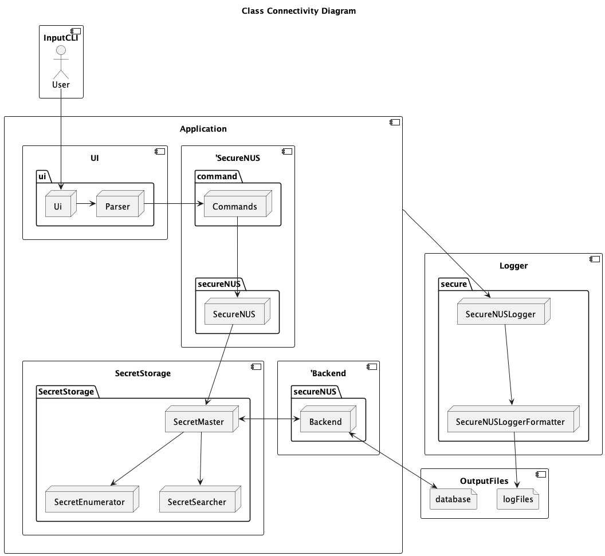 

Here, each cuboid represents a class. The **Logger** component is extracted from the 
Application Component to represent that every part of the application is directly 
connected to the Logger. For the sake of better viewability, the **Logger** component 
will be excluded for better viewability and clarity of the diagram, since it is 
intricately interwoven in every class, across many methods.

<table>
    <tr>
        <td> <a href="#developer-guide">Back to Table of Contents </a> </td>
    </tr>
</table>  

___
#### How the architecture components interact with each other

The Sequence Diagram below shows how the components interact with each other for the 
scenario where the user creates a new basic password initiated using the command 
`new password.` Some details are omitted for the sake of better viewability in demonstration. Details after the loop are removed as well.


[//]: # (@@author stevenantya)


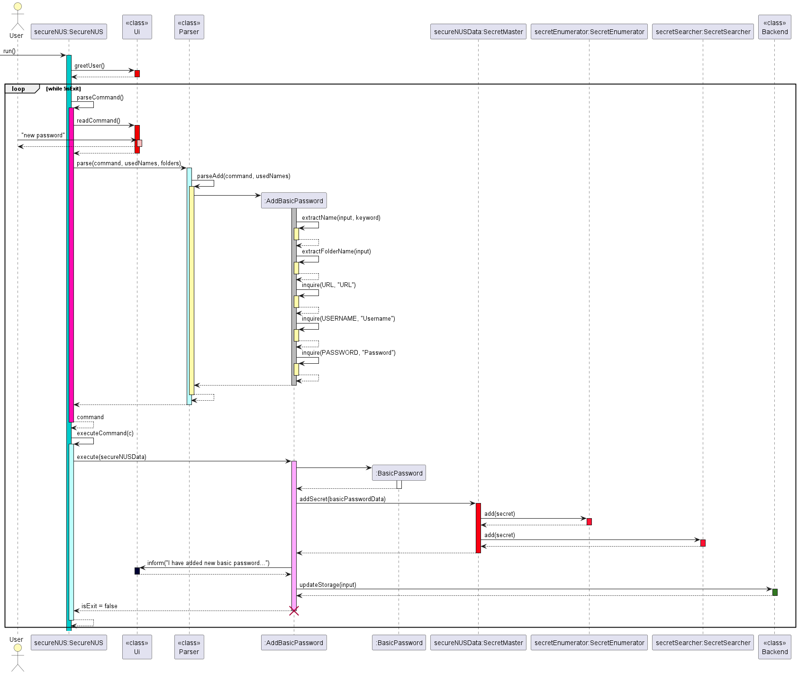

In the diagram above, the following Components-Classes are:
* **UI**- Ui, Parser 
* **SecureNUS**- secureNUS:SecureNUS 
* **SecretStorage**- SecretMaster, SecretEnumerator, SecretSearcher 
* **Backend**- Backend

The **SecureNUS** Component runs the loop that awaits a response from the user. 
This command `new password` is being handled by the UI


[//]: # (@@author ollayf)
<table>
    <tr>
        <td> <a href="#developer-guide">Back to Table of Contents </a> </td>
    </tr>
</table>

---

#### SecureNUS Component
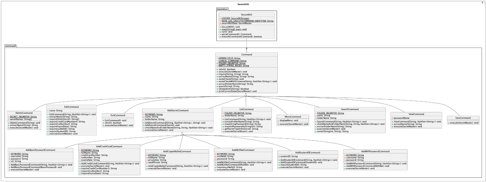
<u>Class Diagram of SecureNUS Component</u>

The above diagram shows how the SecureNUS component works.

**SecureNUS** is the main driver of this java application. All of the user inputs will go through the UI component then parsed through the Parser class, which creates one of the predefined Command objects. The command defined by the Command object is then executed by the SecureNUS object which grants the Command objects access to read or write data from the SecretStorage Component.

##### Command
The API of this component is specified in the package **command**.
Command is an abstract class that is inherited by various components such as AddBasicPasswordCommand.java


The diagram above shows a simple example of how the command is created before being 
executed by the **SecureNUS. Not all classes are shown here for simplicity.** The Command 
consists of the Command abstract class that handles all of its command constructors and 
executions through its child classes. Sequentially, the user inputs a command in Ui, 
that is parsed in Parser, which then instantiates a Command object, which is then executed
by SecureNUS object.

#### SecretStorage Component
The API of this component is specified in the package `storage`. The diagram below features the high-level understanding of how this component works. Each rectangle represents a class, while the SecureNUS and Backend nodes represent components.


The **SecretStorage** component abstracts the data that is to be stored into many views/ 
indexes. This optimizes the speed of queries for many types of queries without developers 
needing to access the individual data structures used. The data structures, namely 
Hash Table and Array are stored in the SecretSearcher and SecretEnumerator class 
respectively. This allows for optimised queries for different operations, namely 
getting the secrets by name and index (within or without folders) at O(1) time. 
During the initialisation of the application, the Backend will import past data 
to the SecretMaster. During saving/ termination of the application, the **SecretMaster** 
class will export the data stored in **SecretEnumerator** (the one with the ArrayList View) 
and Backend will handle encrypting and saving it into an external file.

The following class diagrams show how these work in the code.

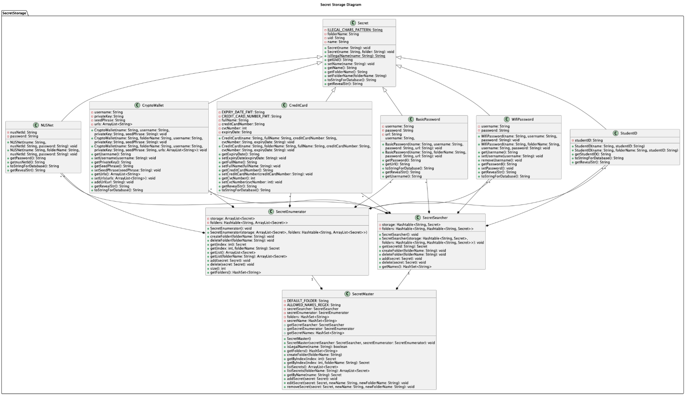
<u>Class Diagram of SecretStorage Component</u>


<u>Class Diagram of SecretStorage Component without methods</u>

---

#### Backend Component

The API of this component is specified in the class `Backend.java`. In this diagram, rectangles and cuboids represent classes.


The backend manages the saving and loading of data from the database.txt file. To do so, it collates and organizes information stored in the SecretMaster and encrypts it into the database.txt. When starting up, it will decrypt the database.txt file and transfer its data into the SecretMaster.

The following class diagram shows how these work in the code. Details of the secrets and storage packages which are in the other components are removed for better viewability.

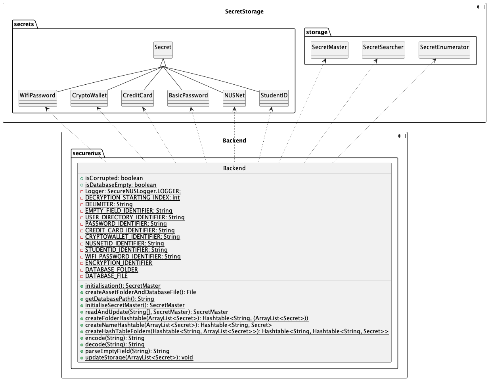
<u>Class Diagram of Backend Component</u>

---

#### UI Component

The API of this component is specified in `Ui` The following diagram shows a high level understanding of how the UI Component works. The rectangles represent classes while the cuboids represent Components.


The UI consists of the Ui class which handles all the inputs provided by the user. The Ui then sends information to the 
parser which will interpret the commands provided by user input. The **Parser** will create **Commands** which will be
sent to **SecureNUS** to execute some command that will alter the data in SecretStorage. 
The **Ui** also handles 
responses/ feedback to the User.

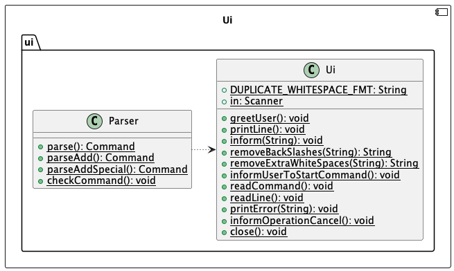
<u>Class Diagram for UI Component</u>
<table>
    <tr>
        <td> <a href="#developer-guide">Back to Table of Contents </a> </td>
    </tr>
</table>

---

## Implementation

This section describes some noteworthy details on how certain features are implemented.
This developer guide will show an example of 3 implementations, namely,
Add Basic Password Feature, Delete Password Feature, and List Password Feature


### Add Basic Password

The `new` function allows the user to add new basic password stored in the password manager. When the user selects the add basic password function, they will be prompted to enter the name, url, 
username, and password. Once the users enters the prompt, a new password will be created

The basic password, an object that extends the secret object, has a mechanism that is facilitated by SecureNUS’s parse() and execute() command. It is then stored internally in ArrayList<Secret> in SecretStorage, and is saved to database.txt by the Backend class.

Basic Password has attributes: name, folder name, username, password and url.

To instantiate a basic password object, parse command creates a constructor of BasicPassword that extends Secret. The class prompts the user to input these additional attributes.

AddBasicPasswordCommand extends AddSecret abstract class and extends Command class. The Add Basic Password feature will implement the following operations:

- **SecureNUS#parseCommand()**
- **SecureNUS#execute(Command)**
- **AddBasicPassword#addSecret(BasicPassword)**
- **SecureNUS#updateStorage(ArrayList<Secret>)**


Given below is an example usage scenario and how instantiation of basic password behaves at each step. Some details are omitted for the sake of better viewability in demonstration. Details after the loop are removed as well. The usage scenario is not an object diagram, a sequence diagram, nor a class diagram. It is purely to demonstrate the feature usage.


**Step 1.** The user launches the application for the first time. The SecureNUS will be initialized. The user will interact directly with SecureNUS Class.
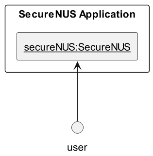

**Step 2.** When the user executes “new basic_password” command to add basic password, the SecureNUS calls parse() method to parse the user’s input
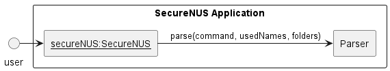

**Step 3.** AddBasicPasswordCommand is then instantiated by the Parser by calling its constructor.


**Step 4.** The parser then would return back to the SecureNUS class, which will then call the execute method in the AddBasicPasswordCommand object. The method will return false in this case because it is not an exit command
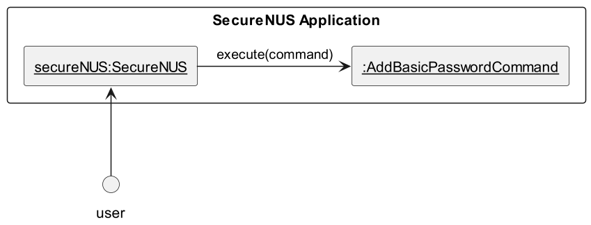

**Step 5.** In the AddBasicPasswordCommand execute method, it will instantiate a new BasicPassword Secret object.
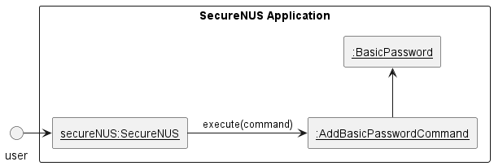

**Step 6.** The BasicPassword object will then be written to the SecretMaster that stores all of the password locally
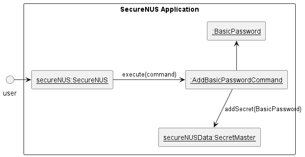

**Step 7.** Finally, when saving, the data in the SecretMaster is then written to the harddisk by the Backend.
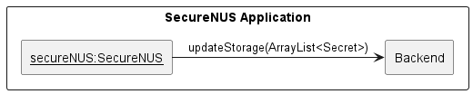

The complete sequence diagram is given below

<u>Sequence Diagram of Add Basic Password</u>

<table>
    <tr>
        <td> <a href="#developer-guide">Back to Table of Contents </a> </td>
    </tr>
</table>

---

### Delete a Password
The `delete` function allows the user to delete a stored password from the password manager. When the user selects the "delete" function, they will be prompted to enter the name of the password they want to delete. Once the user enters the name, the app will delete the password from SecretMaster if it exists.

Delete Password has attribute: name

To instantiate a DeleteCommand object, parse command creates a constructor of DeleteCommand that extends Command.

The Delete feature will implement the following operations:
- **SecureNUS#parseCommand()**
- **SecureNUS#execute(Command)**
- **DeleteCommand#removeSecret(deleteData)**
- **SecureNUS#updateStorage(ArrayList<Secret>)**

Given below is an example usage scenario and how instantiation of basic password behaves at each step. Some details are omitted for the sake of better viewability in demonstration. Details after the loop are removed as well. The usage scenario is not an object diagram, sequence diagram, nor a class diagram. It is purely to demonstrate the feature usage.


**Step 1.** The user launches the application for the first time. The SecureNUS will be initialized. The user will interact directly with SecureNUS Class.


**Step 2.** When the user executes “delete basic_password” command to delete basic password, the SecureNUS calls parse() method to parse the user’s input


**Step 3.** DeleteCommand is then instantiated by the Parser by calling its constructor.
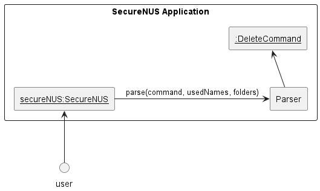

**Step 4.** The parser then would return back to the SecureNUS, which will then call the execute method in the DeleteCommand object. The method will return false in this case because it is not an exit command
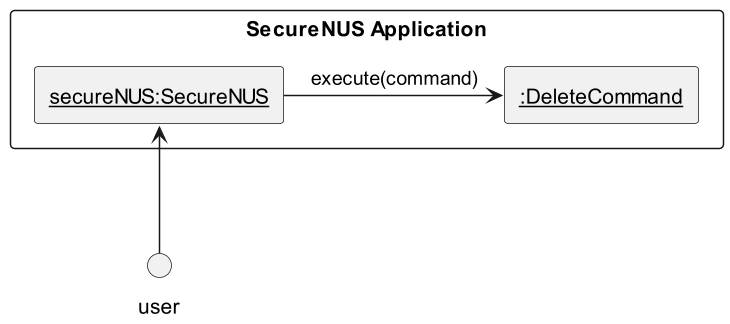

**Step 5.** In the DeleteCommand execute method, it will delete the corresponding Secret object in the SecretMaster.
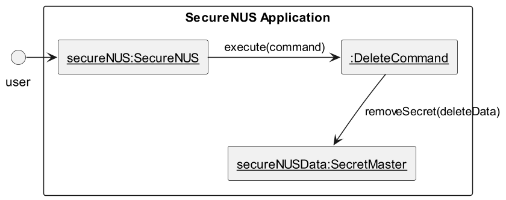

**Step 6.** Finally when saving, the updated data in the SecretMaster is then written to the harddisk by the Backend.


The complete sequence diagram is given below.
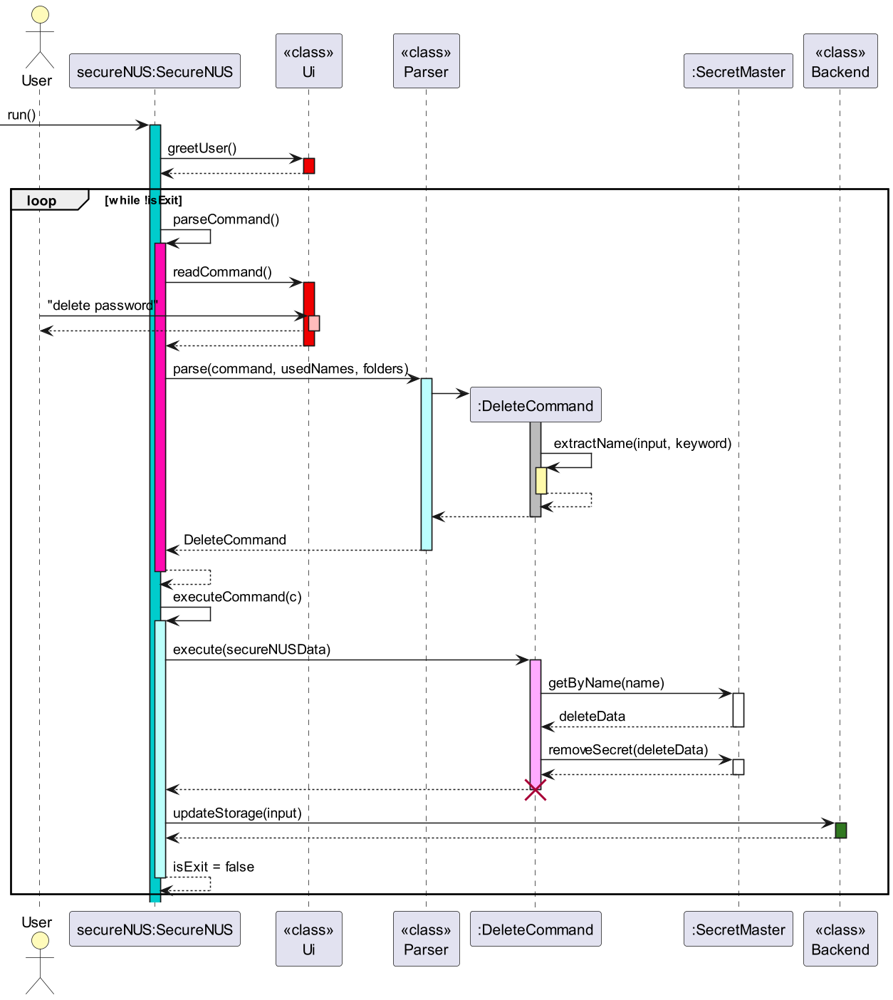
<u>Sequence Diagram of Delete Command</u>

<table>
    <tr>
        <td> <a href="#developer-guide">Back to Table of Contents </a> </td>
    </tr>
</table>

---

### List all Secrets
The `list` function allows the user to view all the passwords stored in the password 
manager along with their descriptions. When the user selects the `list` function, the app will display all the stored passwords and their descriptions in a table format. The table will include columns for the name of the password, its description, and the date it was added to the password manager.

List has attributes: folder name

To instantiate a basic password object, parse command creates a constructor of ListCommand that has attribute folderName.

The List feature will implement the following operations:


- **SecureNUS#parseCommand()**
- **SecureNUS#execute(Command)**
- **ListCommand#listSecrets(folderName)**
- **ListCommand#getSecretTypeInfo(secret)**

Given below is an example usage scenario and how instantiation of basic password behaves at each step. Some details are omitted for the sake of better viewability in demonstration. Details after the loop are removed as well. The usage scenario is not an object diagram, sequence diagram, nor a class diagram. It is purely to demonstrate the feature usage.


**Step 1.** The user launches the application for the first time. The SecureNUS will be initialized. The user will interact directly with SecureNUS Class.


**Step 2.** When the user executes “list folderName” command to list all passwords in folder folderName, the SecureNUS calls parse() method to parse the user’s input


**Step 3.** ListCommand is then instantiated by the Parser by calling its constructor.
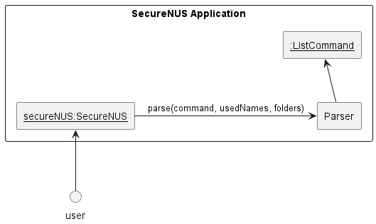

**Step 4.** The parser then would return back to the SecureNUS, which will then call the execute method in the ListCommand object. The method will return false in this case because it is not an exit command
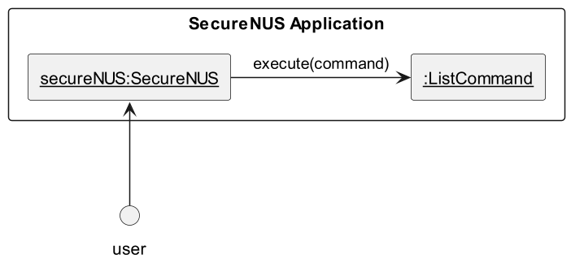

**Step 5.** In the ListCommand execute method, listSecrets will access the secrets from the SecretMaster.
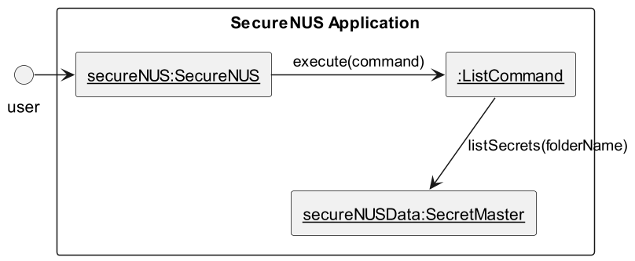

**Step 6.** In the ListCommand execute method, getSecretTypeInfo will return the corresponding secret’s information (Name, username, url, password) from the SecretMaster.
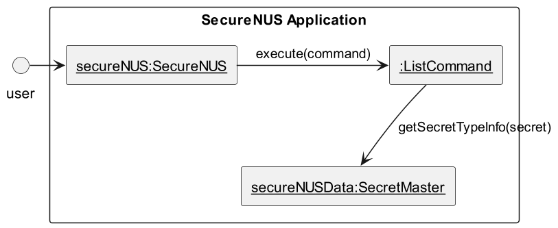

**Step 7.** Finally, it will output using system.out to the terminal.
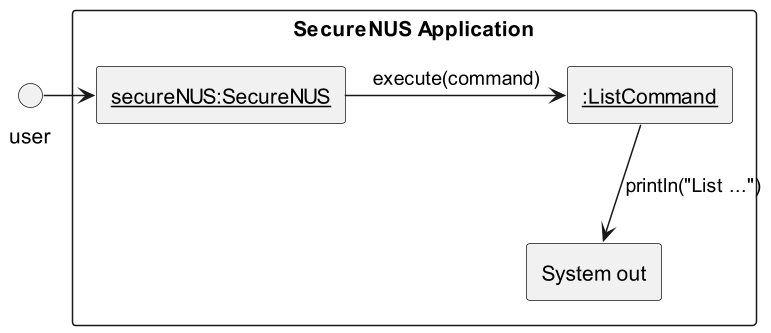

The complete sequence diagram is given below.


This simplified sequence diagram shows what happens when a user lists all passwords in a folder called folderName:

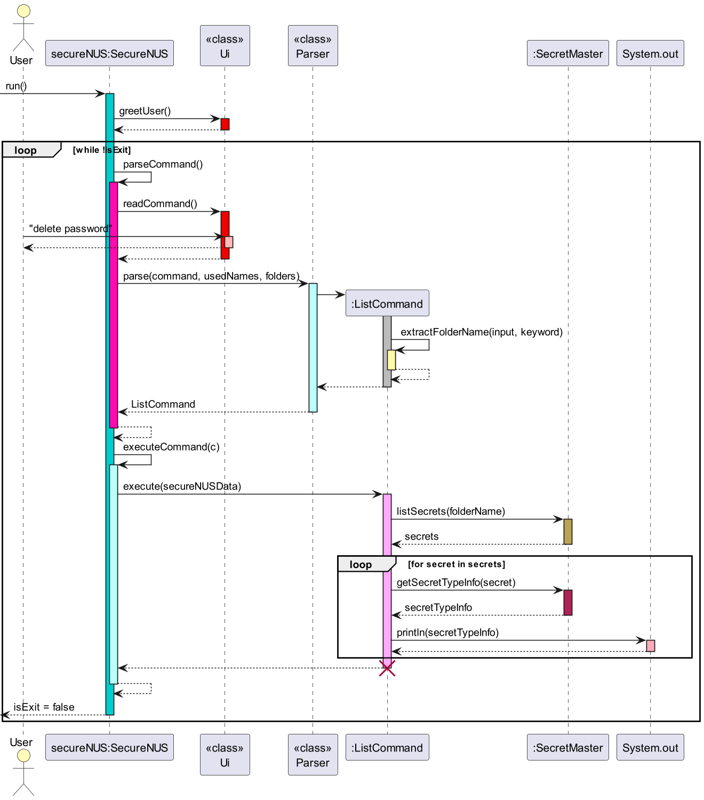
<u>Sequence Diagram of List Command</u>

<table>
    <tr>
        <td> <a href="#developer-guide">Back to Table of Contents </a> </td>
    </tr>
</table>

---

## Appendix: Requirements
[//]: # (@@author euzhengxi)
### Product Scope

#### Target user profile:
* has a need to manage a significant number of passwords
* prefer desktop apps over other types
* can type fast
* prefers typing to mouse interactions
* is reasonably comfortable using CLI apps


#### Value proposition:
* SecureNUS manages passwords faster than a typical mouse/GUI-driven password manager app.
* SecureNUS allows you to store, search and retrieve passwords based on inputs given.
* SecureNUS manages and stores passwords locally, there is no risk of a server side failure/ attack leaking your passwords

<table>
    <tr>
        <td> <a href="#developer-guide">Back to Table of Contents </a> </td>
    </tr>
</table>

---

[//]: # (@@author kairuler)
### User Stories

<table class="c43"><tr class="c22"><td class="c17" colspan="1" rowspan="1"><p class="c4"><span class="c3">Priority</span></p></td><td class="c53" colspan="1" rowspan="1"><p class="c4"><span class="c3">As a &hellip;</span></p></td><td class="c40" colspan="1" rowspan="1"><p class="c4"><span class="c3">I want to &hellip;</span></p></td><td class="c44" colspan="1" rowspan="1"><p class="c4"><span class="c3">So that I can &hellip;</span></p></td></tr><tr class="c22"><td class="c24" colspan="1" rowspan="1"><p class="c4"><span class="c0">***</span></p></td><td class="c35" colspan="1" rowspan="1"><p class="c4"><span class="c0">user</span></p></td><td class="c23" colspan="1" rowspan="1"><p class="c4"><span>view all my passwords in a single location</span></p></td><td class="c25" colspan="1" rowspan="1"><p class="c4"><span>have an overview of all my stored passwords</span></p></td></tr><tr class="c22"><td class="c24" colspan="1" rowspan="1"><p class="c4"><span class="c0">***</span></p></td><td class="c35" colspan="1" rowspan="1"><p class="c4"><span class="c0">user</span></p></td><td class="c23" colspan="1" rowspan="1"><p class="c4"><span>find my passwords in an intuitive and structured manner</span></p></td><td class="c25" colspan="1" rowspan="1"><p class="c4"><span class="c0">easily retrieve a password</span></p></td></tr><tr class="c22"><td class="c24" colspan="1" rowspan="1"><p class="c4"><span class="c0">***</span></p></td><td class="c35" colspan="1" rowspan="1"><p class="c4"><span class="c0">user</span></p></td><td class="c23" colspan="1" rowspan="1"><p class="c4"><span class="c0">Store different types of passwords</span></p></td><td class="c25" colspan="1" rowspan="1"><p class="c4"><span class="c0">easily retrieve passwords with multiple hidden fields like a Credit Card.</span></p></td></tr><tr class="c22"><td class="c24" colspan="1" rowspan="1"><p class="c4"><span class="c0">***</span></p></td><td class="c35" colspan="1" rowspan="1"><p class="c4"><span class="c0">user</span></p></td><td class="c23" colspan="1" rowspan="1"><p class="c4"><span>view all my stored passwords at a glance (without details)</span></p></td><td class="c25" colspan="1" rowspan="1"><p class="c4"><span>quickly see what passwords I have used before</span></p></td></tr><tr class="c22"><td class="c24" colspan="1" rowspan="1"><p class="c4"><span class="c0">***</span></p></td><td class="c35" colspan="1" rowspan="1"><p class="c4"><span class="c0">user</span></p></td><td class="c23" colspan="1" rowspan="1"><p class="c4"><span>delete stored passwords</span></p></td><td class="c25" colspan="1" rowspan="1"><p class="c4"><span class="c0">remove passwords that I no longer use</span></p></td></tr><tr class="c22"><td class="c24" colspan="1" rowspan="1"><p class="c4"><span class="c0">***</span></p></td><td class="c35" colspan="1" rowspan="1"><p class="c4"><span class="c0">user</span></p></td><td class="c23" colspan="1" rowspan="1"><p class="c4"><span class="c0">save my passwords across different sessions</span></p></td><td class="c25" colspan="1" rowspan="1"><p class="c4"><span class="c0">Keep my passwords across different sessions without the need to constantly retype or keep the application online to ensure the storage is not cleared.</span></p></td></tr><tr class="c22"><td class="c24" colspan="1" rowspan="1"><p class="c4"><span class="c0">***</span></p></td><td class="c35" colspan="1" rowspan="1"><p class="c4"><span class="c0">user</span></p></td><td class="c23" colspan="1" rowspan="1"><p class="c4"><span>use local storage to store my passwords</span></p></td><td class="c25" colspan="1" rowspan="1"><p class="c4"><span>have my passwords stored locally so that they are safer from online breaches</span></p></td></tr><tr class="c19"><td class="c24" colspan="1" rowspan="1"><p class="c4"><span class="c0">***</span></p></td><td class="c35" colspan="1" rowspan="1"><p class="c4"><span class="c0">user</span></p></td><td class="c23" colspan="1" rowspan="1"><p class="c4"><span class="c0">encrypt my passwords when saving in the file</span></p></td><td class="c25" colspan="1" rowspan="1"><p class="c4"><span class="c0">ensure that nobody but me has access to the .txt file that stores my passwords</span></p></td></tr><tr class="c19"><td class="c24" colspan="1" rowspan="1"><p class="c4"><span class="c0">**</span></p></td><td class="c35" colspan="1" rowspan="1"><p class="c4"><span class="c0">user</span></p></td><td class="c23" colspan="1" rowspan="1"><p class="c4"><span class="c0">cancel a password addition when i mistype something wrong</span></p></td><td class="c25" colspan="1" rowspan="1"><p class="c4"><span class="c0">Use less commands to rectify my mistake made</span></p></td></tr><tr class="c19"><td class="c24" colspan="1" rowspan="1"><p class="c4"><span class="c0">**</span></p></td><td class="c35" colspan="1" rowspan="1"><p class="c4"><span class="c0">user</span></p></td><td class="c23" colspan="1" rowspan="1"><p class="c4"><span class="c0">authenticate myself before accessing</span></p></td><td class="c25" colspan="1" rowspan="1"><p class="c4"><span class="c0">ensure that nobody else but me gets access to my stored passwords</span></p></td></tr><tr class="c19"><td class="c24" colspan="1" rowspan="1"><p class="c4"><span class="c0">**</span></p></td><td class="c35" colspan="1" rowspan="1"><p class="c4"><span class="c0">user</span></p></td><td class="c23" colspan="1" rowspan="1"><p class="c4"><span class="c0">know when I created a certain password</span></p></td><td class="c25" colspan="1" rowspan="1"><p class="c4"><span class="c0">keep track of how long my passwords have been used for</span></p></td></tr><tr class="c19"><td class="c24" colspan="1" rowspan="1"><p class="c4"><span class="c0">**</span></p></td><td class="c35" colspan="1" rowspan="1"><p class="c4"><span class="c0">user</span></p></td><td class="c23" colspan="1" rowspan="1"><p class="c4"><span class="c0">not have to think of a strong password by myself and let the app handle it</span></p></td><td class="c25" colspan="1" rowspan="1"><p class="c4"><span class="c0">know when to change my password as passwords should be changed periodically</span></p></td></tr><tr class="c19"><td class="c24" colspan="1" rowspan="1"><p class="c4"><span class="c0">**</span></p></td><td class="c35" colspan="1" rowspan="1"><p class="c4"><span class="c0">user</span></p></td><td class="c23" colspan="1" rowspan="1"><p class="c4"><span class="c0">search/filter out specific passwords</span></p></td><td class="c25" colspan="1" rowspan="1"><p class="c4"><span class="c0">quickly refer to a password that is used for a specific login (e.g. password for NUS email)</span></p></td></tr><tr class="c19"><td class="c24" colspan="1" rowspan="1"><p class="c4"><span class="c0">**</span></p></td><td class="c35" colspan="1" rowspan="1"><p class="c4"><span class="c0">user</span></p></td><td class="c23" colspan="1" rowspan="1"><p class="c4"><span class="c0">copy and paste my passwords</span></p></td><td class="c25" colspan="1" rowspan="1"><p class="c4"><span class="c0">not have the password revealed on my terminal, simply paste from clipboard</span></p></td></tr><tr class="c19"><td class="c24" colspan="1" rowspan="1"><p class="c4"><span class="c0">*</span></p></td><td class="c35" colspan="1" rowspan="1"><p class="c4"><span class="c0">user</span></p></td><td class="c23" colspan="1" rowspan="1"><p class="c4"><span class="c0">hide my password while typing it</span></p></td><td class="c25" colspan="1" rowspan="1"><p class="c4"><span>not allow people around me to view my password as I type</span></p></td></tr><tr class="c19"><td class="c24" colspan="1" rowspan="1"><p class="c4"><span class="c0">*</span></p></td><td class="c35" colspan="1" rowspan="1"><p class="c4"><span class="c0">first-time user</span></p></td><td class="c23" colspan="1" rowspan="1"><p class="c4"><span class="c0">want to be able to see the demo to use the password manager</span></p></td><td class="c25" colspan="1" rowspan="1"><p class="c4"><span class="c0">learn how to use SecureNUS</span></p></td></tr><tr class="c19"><td class="c24" colspan="1" rowspan="1"><p class="c4"><span class="c0">*</span></p></td><td class="c35" colspan="1" rowspan="1"><p class="c4"><span class="c0">user</span></p></td><td class="c23" colspan="1" rowspan="1"><p class="c4"><span class="c0">receive notification any of my previous passwords are reused</span></p></td><td class="c25" colspan="1" rowspan="1"><p class="c4"><span class="c0">use a new and different password each time</span></p></td></tr><tr class="c19"><td class="c24" colspan="1" rowspan="1"><p class="c4"><span class="c0">*</span></p></td><td class="c35" colspan="1" rowspan="1"><p class="c4"><span class="c0">user</span></p></td><td class="c23" colspan="1" rowspan="1"><p class="c4"><span class="c0">receive reminder to change passwords that have not been changed for an extended period of time</span></p></td><td class="c25" colspan="1" rowspan="1"><p class="c4"><span class="c0">not have to check every single password manually (but still have the ability to) to know when to change my passwords</span></p></td></tr><tr class="c19"><td class="c24" colspan="1" rowspan="1"><p class="c4"><span class="c0">*</span></p></td><td class="c35" colspan="1" rowspan="1"><p class="c4"><span class="c0">user</span></p></td><td class="c23" colspan="1" rowspan="1"><p class="c4"><span class="c0">select a particular stored password and expand it to reveal details</span></p></td><td class="c25" colspan="1" rowspan="1"><p class="c4"><span class="c0">use the details of the password to make decisions regarding the password (e.g. change the password if it has been used for a long time, create a stronger password the next time if the current one is not strong, etc.)</span></p></td></tr><tr class="c19"><td class="c24" colspan="1" rowspan="1"><p class="c4"><span class="c0">*</span></p></td><td class="c35" colspan="1" rowspan="1"><p class="c4"><span class="c0">user who wishes to use complex passwords</span></p></td><td class="c23" colspan="1" rowspan="1"><p class="c4"><span class="c0">generate complex passwords for me</span></p></td><td class="c25" colspan="1" rowspan="1"><p class="c4"><span class="c0">not have to think of a strong password by myself and let the app handle it</span></p></td></tr><tr class="c19"><td class="c24" colspan="1" rowspan="1"><p class="c4"><span class="c0">*</span></p></td><td class="c35" colspan="1" rowspan="1"><p class="c4"><span class="c0">user</span></p></td><td class="c23" colspan="1" rowspan="1"><p class="c4"><span class="c0">sync my stored passwords manually</span></p></td><td class="c25" colspan="1" rowspan="1"><p class="c4"><span class="c0">have my stored passwords on different devices</span></p></td></tr></table>

<table>
    <tr>
        <td> <a href="#developer-guide">Back to Table of Contents </a> </td>
    </tr>
</table>

---

### Non-Functional Requirements

* Should be responsive and fast, providing quick access to passwords and other information within one or two commands.
* Should be user-friendly, with intuitive commands that makes it easy for users to create, store, and retrieve passwords.
* Should be compatible with various operating systems as long as Java 11 or above is installed.
* Should be reliable and operational all the time with little-to-no bugs or errors.
* Should be able to store at least 1000 passwords without compromising performance or security.
* Should be maintainable, with a clear and well-documented codebase that makes it easy to fix bugs and add new features.
* Must ensure that user data is not shared with third parties without user consent.
* Should be secure, using strong encryption to protect user passwords and data from being hacked or stolen.

<table>
    <tr>
        <td> <a href="#developer-guide">Back to Table of Contents </a> </td>
    </tr>
</table>

---


### Glossary

* _Secret_ - Represents the basic "Password-like" class, which is the parent class of all password classes.
* _Database_ - Represents the text file we use to store passwords input by the user
* _UI_ - Represents the aspects of the application code we use to interact with the user via the command line.
* _Logger/ Logging_: Represents the part of the code dedicated to storing of important state information and input that can help developers debug code in the event of an unexpected crash
* _Storage/ SecretStorage_: represents the faculties for storing information input by the user into memory in a format that supports different types of functions like exporting, saving, displaying, editing and more.
* _Exporting/ Saving_: represents the internal processes to convert storage data in the application memory into an output textfile which can be loaded in future sessions.

<table>
    <tr>
        <td> <a href="#developer-guide">Back to Table of Contents </a> </td>
    </tr>
</table>

---


## Appendix: Instructions for manual testing

### Launch and shutdown
1. Initial launch 
   1. Download the jar file and copy it into an empty folder. 
   2. Open a command window (If you are on Windows, use the DOS prompt or the PowerShell). 
   3. Run the `java -version` command to ensure you are using Java 11. 
   4. Launch the jar file using the `java -jar` command rather than double-clicking (reason: to ensure the jar file is using the same java version that you verified above). Use double-clicking as a last resort. 
2. Shutdown 
   1. Enter the `exit` command 
      Expected: Exits the program gracefully. All data is saved.

### Saving data 
The following directory and file will be created upon initial launch of SecureNUS:
```
assets/database.txt
```
Stored passwords are saved after exiting the program gracefully.
1. Missing directory 
   1. Simulate by deleting the `assets` folder 
   2. Expected: A new folder will be created upon the next launch of the program, with an empty `database.txt` file inside 
2. Missing data file 
   1. Simulate by deleting the `database.txt` file in the `assets` folder 
   2. Expected: An empty `database.txt` file will be created in the ‘assets’ folder upon the next launch of the program 
3. Data not saved 
   1. Simulate by forcefully exiting the program (i.e. exit without entering the `exit` command)
   2. Expected: All unsaved data is lost

### Menu of all commands
1. `menu`
   Expected: Displays menu.

### Adding a password
1. `new myBasicPassword1`
   Expected: Input fields are displayed and user keys in the relevant details. The basic password is then stored successfully.
2. `new myBasicPassword2 f/myFolder`
   Expected: Same as previous, but this basic password is filed under `myFolder` folder
3. Incorrect format like `new`, `new o/`, `new o/InvalidPasswordType`
   Expected: Error message displayed.

### Listing all passwords
1. `list`
   Expected: Lists `myBasicPassword1`, `myBasicPassword2` and `myNUSNetPassword` and their details
2. `list f/myFolder`
3. Expected: Lists `myNUSNetPassword` only
   Incorrect format like `list f/nonExistentFolder`
   Expected: Error message displayed.

### Search for password
1. `search my`
   Expected: Displays three passwords with names containing “my”

### View password
1. `view myBasicPassword1`
   Expected: Displays password and details of `myBasicPassword1`
2. Incorrect format like `view`, `view nonExistentPassword`
   Expected: Error message displayed.
   
### Edit password
1. `edit myBasicPassword1`
   Expected: Input field displayed for user to enter new password for `myBasicPassword1`
2. Incorrect format like `edit`, `edit nonExistentPassword`
   Expected: Error message displayed.

### Delete password
1. `delete myBasicPassword1`
   Expected: `myBasicPassword1` is removed from storage.
2. Incorrect format like `delete`, `delete nonExistentPassword`
   Expected: Error message displayed.
<table>
    <tr>
        <td> <a href="#developer-guide">Back to Table of Contents </a> </td>
    </tr>
</table>

---