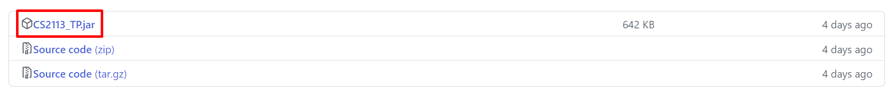
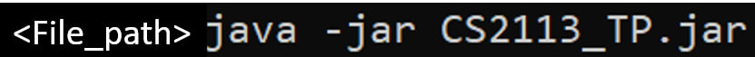
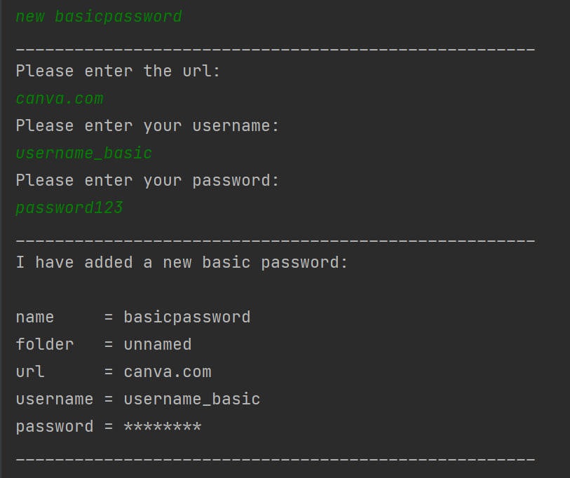
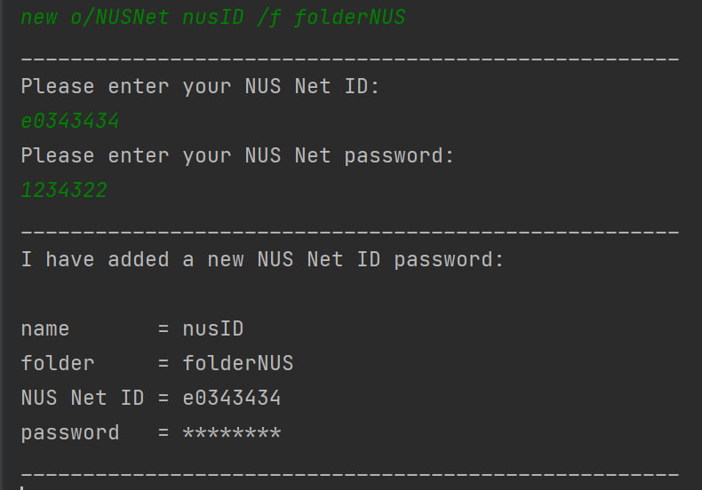
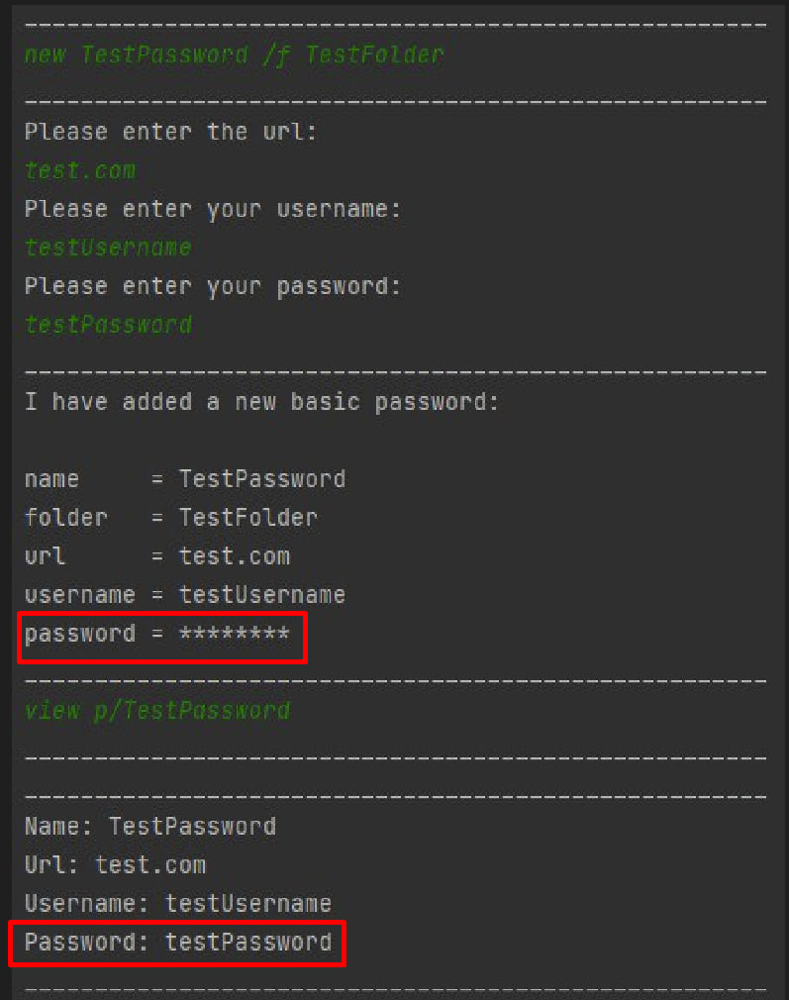

# **User Guide for SecureNUS**

## Introduction
SecureNUS is a desktop Command Line Interface (CLI) application that allows users to manage and store their passwords 
securely. It operates on a command-line interface that allows for a simple and efficient management of passwords for 
fast typists.\
SecureNUS aims to provide a helping hand to all the students studying in National University of Singapore who faces
difficulty handling many passwords from different sites.
<br>

- [Quick Start](#quick-start)
- [Feature List](#feature-list)
- [Feature Details](#feature-details)
- [FAQ's](#faqs)
- [Command Summary](#command-summary)
<br>

## Quick Start
1. Ensure you have Java `11` or above installed on your computer.
2. Download the latest `CS2113_TP.jar` from [here](https://github.com/AY2223S2-CS2113-T15-2/tp/releases).
   

3. Move the `CS2113_TP.jar` file to a desired folder.
4. Open a command terminal, `cd "<path of file>"` into the folder to where you put your `CS2113_TP.jar` file in, 
and use the `java -jar CS2113_TP.jar` command to start SecureNUS. 

If above steps are correctly followed, you will see
the following on startup.
    ````text
     Welcome to secureNUS v1.0
     Current Features
     Adding a password      : new [NAME] /f [FOLDER_NAME]
     Adding a NUSNet ID     : new o/NUSNet [NAME] /f [FOLDER_NAME]
     Adding a Student ID    : new o/StudentID [NAME] /f [FOLDER_NAME]
    ````
5. Type the command in the command box and press Enter to execute it.<br> e.g. typing `menu` and pressing Enter key 
will open the menu window.

6. To exit SecureNUS, type `exit` command.

## Feature List
1. [Add new password](#add-a-new-password)
   - Type of Passwords
     1. Basic Password
     2. Credit Card
     3. Crypto Wallet
     4. NUSNet (Starting with 'e')
     5. StudentID (Starting with 'A')
     6. WiFi Password
2. [Delete a password](#delete-a-password) 
3. [List passwords](#list-all-passwords)
4. [View password](#viewing-password-in-command-line) 
5. [Search for a specific password](#general-format--search-nnamelike--f-ffolderlike)
6. [Save the passwords](#general-format--save) 
7. [Load all passwords](#general-format--load--a-append-ffilepath)
8. [Edit current passwords](#general-format--edit-ppasswordname--f-nfnewfoldername--d-ndnew description--n-npnewpasswordname)
9. [Menu for commands](#menu--menu)
10. [Exit ](#exiting-the-program--exit)

## Feature Details

#### Note about the command format:
* Words in `UPPER_CASE` are the parameters to be supplied by the user.
* Items in square brackets `[]` are optional.
* Items with `[…]` after them can be used multiple times including zero times.
* Extraneous parameters for commands that do not take in parameters (such as `menu`, and `exit`) will be ignored. <br>
e.g. if the command specifies `menu 234`, it will be interpreted as `menu`.

<br>

### Add a new password
- Adds a new password in SecureNUS based on the type of the password.
- Opens a list of questions to fill required particulars based on the option of the password selected.
- Ctrl+C at any time to cancel the creation.

###### General Format:  `new [o/OPTIONS] PASSWORD_NAME [f/ FOLDER_NAME]`
###### Options of passwords: 
1. Basic Password - `new PASSWORD_NAME [f/ FOLDER_NAME]`
2. Credit Card - `new [o/CreditCard] PASSWORD_NAME [f/ FOLDER_NAME]`
3. Crypto Wallet - `new [o/CryptoWallet] PASSWORD_NAME [f/ FOLDER_NAME]`
4. NUSNet ID - `new [o/NUSNet] PASSWORD_NAME [f/ FOLDER_NAME]`
5. Student ID - `new [o/StudentID] PASSWORD_NAME [f/ FOLDER_NAME]`
6. WiFi Password - `new [o/WifiPassword] PASSWORD_NAME [f/ FOLDER_NAME]`

###### Examples: <br>
 <br>

<br>

### Delete a password
- Deletes a list of passwords. The hash or name of the password can be used.
###### General Format: `delete PASSWORD_NAME1 PASSWORD_NAME2 […]`
###### Examples: <br>
```
// Have to update latest image 
```
<br>

### List all passwords
- List all the passwords in the folder specified.
- If a folder is added, it will only list out passwords in the folder else it will list out all the passwords stored by
  the user irrespective of folder name.
- For password security, the password will be masked with asterisks (********) which can be viewed by the `view` command
###### General Format: `list [FOLDER_NAME]`

###### Examples: <br>


<br>

### View Password in Command Line
- On creating new passwords using `new` command, the password entered by the user is hidden under the asterisks
  (********) to ensure a higher security.
- One can use the `view` command to view the original password. 

###### General Format: `view p/PASSWORD_NAME`

###### Examples: <br>

<br>

### Search Passwords
- Helps in finding the passwords stored in the list of passwords by searching using partial characters of PASSWORD_NAME
or FOLDER_NAME.
- Do note: password names are **Case Sensitive**

###### General Format: `search n/NAME_LIKE [-f f/FOLDER_LIKE]`

###### Examples: <br>
 <br>
 <br>
<br>


### Saving Passwords
- Saves all the passwords in an output logfile: `./logs/out`
###### General Format: `save`

<br>

### Loading Passwords
- Loads all password from a textfile (.txt)
- Use -a if you want these to be appended. Otherwise, it will erase and overwrite all other passwords. 
- Default input logfile: `./logs/in`
###### General Format: `load [-a, –append] [f/FILE_PATH]`
###### Examples: <br>
```
load -a f/~/users/cs2113/passwords.txt
```
<br>

### Editing Password
- Allows users to edit exisitng password.
- If no flags added, it will open a prompt to input your new password.

###### General Format: `edit p/PASSWORD_NAME [-f nf/NEW_FOLDER_NAME] [-d nd/NEW_DESCRIPTION] [-N np/NEW_PASSWORD_NAME]`

###### Examples: <br>

```
edit p/canva.com -f nf/School_Stuffs -d nd/My Modules Website -N np/canvas.nus.edu.sg
```
Output:
```
Enter your new password:							
```
<br>

### Menu for reference
- Allows users to refer to all the CLI commands by typing one command.

###### General Format: `menu`

<br>

### Exiting the Program
- Exits the program. 
- Shows a message with all possible commands and syntax.

###### General Format: `exit`

<br>

## FAQ's

**Q**: I forgot to save before exiting. Are all my passwords lost?

**A**: By default, the program will save the last copy of the passwords before exiting in the filepath ./logs/last_exit if allowed to exit gracefully

**Q**: What if I create a password without a folder?

**A**: Do not worry! Your password is still saved in the unnamed folder.

## Command Summary


<table>
  <tr>
   <td>Action
   </td>
   <td>Format/Examples
   </td>
  </tr>
  <tr>
   <td>New
   </td>
   <td><code>new [o/OPTIONS] PASSWORD_NAME </code>
   </td>
  </tr>
  <tr>
   <td>Delete
   </td>
   <td><code>delete p1/PASSWORD_1 [p2/PASSWORD_2] [...]</code>
   </td>
  </tr>
  <tr>
   <td>List
   </td>
   <td><code>list [f/FOLDER_NAME]</code>
   </td>
  </tr>
  <tr>
   <td>View
   </td>
   <td><code>view p/PASSWORD_NAME</code>
   </td>
  </tr>
  <tr>
   <td>Search
   </td>
   <td><code>search n/NAME_LIKE [-f f/FOLDER_LIKE]</code>
   </td>
  </tr>
  <tr>
   <td>Save
   </td>
   <td><code>save</code>
   </td>
  </tr>
 <tr>
   <td>Load
   </td> 
   <td> <code> load [-a, –append] [f/FILE_PATH]</code>
   </td>
 </tr>
  <tr>
   <td>Edit
   </td>
   <td><code>edit p/PASSWORD_NAME [-f nf/NEW_FOLDER_NAME] [-d nd/NEW_DESCRIPTION] [-N np/NEW_PASSWORD_NAME]</code>
   </td>
  </tr>
</table>

