# **User Guide for SecureNUS**

## Introduction
SecureNUS is a CLI application that provides secure secret management for NUS students. 
It's designed to be efficient and user-friendly, allowing users to securely store and manage passwords using a 
command-line interface.

With a focus on security, SecureNUS employs robust measures such as secret masking, storage, and user convenience.

Its CLI interface allows for fast and streamlined password management, making it an ideal solution for users who are 
comfortable typing commands.

In summary, SecureNUS offers a reliable and secure secret management solution for NUS students, addressing the
challenge of managing multiple passwords for various sites and applications.
<br>

## Table of Contents
- [Introduction](#introduction)
- [Quick Start](#quick-start)
- [Feature List](#feature-list)
- [Feature Details](#feature-details)
- [Frequently Asked Questions (FAQ's)](#frequently-asked-questions)
- [Command Summary](#command-summary)

## Quick Start
1. Ensure you have **Java 11** installed on your computer. If not so, you can download from
    [here](https://www.oracle.com/sg/java/technologies/javase/jdk11-archive-downloads.html).

2. Download the latest `[CS2113-T15-2][SecureNUS].jar` from 
    [here](https://github.com/AY2223S2-CS2113-T15-2/tp/releases).
                                                                 
3. Open a Command Prompt in your system which contains the JAR File.
                                                                          
4. Verify if the Java Version you are using is *Java 11* (recommended and tested version) by using `java -version`
   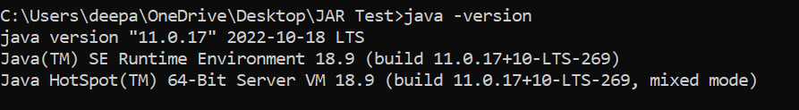                                                                      

5. Using `cd`, navigate to the folder where `[CS2113-T15-2][SecureNUS].jar` is stored in your system. 

6. Launch the application in the terminal after running `java -jar [CS2113-T15-2][SecureNUS].jar` in the terminal. 

    If the program is launched correctly, you can see the following.\
    <br>

7. Type the command when prompted and press enter to execute it. e.g. typing `menu` and pressing menu will give an
overview of all the user commands.<br>
Some example commands:
   * `new sname f/fold`: creates a new general secret with name `sname` in a folder called `fold`.
   * `new o/CreditCard ccname f/ccfold`: creates a secret for storing credit card details with the name `ccname` in 
   `ccfold` folder.
   * `list`: List all the secrets typed by the user.
   * `menu`: List of command used in the program.
   * `view pname`: view the secrets stored under `cname` which is masked for security reasons.
   * `search n/cc f/ccfold`: search for entries in the `ccfold` folder which have `cc` in their name.
   * `edit pname`: edit the secret to another in `pname`.
   * `exit`: exit from the program. 

<table>
    <tr>
        <td> <a href="#table-of-contents">Click here for Table of Contents </a> </td>
    </tr>
</table>


## Feature List
1. [Note about Command Formats](#note-about-the-command-format)
2. [Add new Secret](#add-new-secret)
   - Password Options
     + Basic Password            
     + Credit Card
     + Crypto Wallet
     + NUSNet ID (e.g: e0123456)
     + NUS Student ID (e.g. A1234567B)
     + WiFi Password
3. [Delete a Secret](#delete-a-secret) 
4. [List all Secrets](#list-all-secrets)
5. [View Masked Secret](#view-masked-secret) 
6. [Search for a Secret](#search-secrets)
7. [Save Secrets](#save-secrets) 
8. [Edit current secrets](#edit-secrets)
9. [Menu for commands](#menu)
10. [Exit](#exit)
11. [Cancel current operation](#cancel-current-operation)

<table>
    <tr>
        <td> <a href="#table-of-contents">Click here for Table of Contents </a> </td>
    </tr>
</table>

## Feature Details

### Note about the command format
* Commands in `UPPER_CASE` and without a bracket refers to the essential parameters to be given by the user.
                
* Do note the commands are **Case Sensitive**. 
e.g. <br>
    ````
    exit       // Correct
    eXiT       // Incorrect
    ````
* If user enters a parameter with a command which does not need parameters, it will be considered as invalid command.
e.g. <br>
    ````
    menu       // Correct
    menu123    // Incorrect
    ````

* Commands in square brackets `[]` represents the folder to store the secrets. In our application, users 
can choose not to store a secret in a folder. Thus, every secret with no assigned folder name,
is stored in an `unnamed` folder. 

    **Example of correct syntax:**
    ````    
    new passname              // folder name: unnamed
    new passname f/passfold   // folder name: passfold
    ````                      
  
* Commands with [...] shows that parameters of the same type can be added multiple times.

* Please note that the `NAME` parameter in some commands does not refer to the username.

  `NAME` allows to easily *identify* and *manage* the secrets when performing actions such as 
  deleting, editing, or viewing them. 
  
  We recommend using a descriptive name that accurately reflects the contents 
  of the secrets.

* Do not use `Ctrl-C` in the terminal while running the JAR file as it will cause the program to terminate.

                                                                 
<table>                                                               
    <tr>                                                           
        <td> <a href="#table-of-contents">Click here for Table of Contents </a> </td>                                                            
        <td> <a href="#feature-list">Click here for Feature List </a> </td>                                                      
    </tr>                                                          
</table>                                                           

### Add new Secret

##### Overview:
- SecureNUS provides a simple way to create new secrets in the secret manager with the `new` command.

- Users can select the type of secret they want to store by using the `o/OPTION` extension with the `new` command.
  - If no option is selected, a basic password will be created by default.

- SecureNUS guides users through tailored questions to fill in the required particulars for that password type.
  - These questions ensure that all necessary information is securely stored in one place for that specific type of 
  password.

- Do note, secrets and other sensitive information are masked by asterisks for security purposes. They can be viewed 
using `view` command which will be elaborated upon [here](#view-masked-secret).

- Each time a new secret is created, it will be auto-saved in `database.txt` in the `assets` folder. But 
users are advised to keep saving their passwords using the `save` command. Users can refer [here](#save-secrets)
for more details on the `save` command.

##### Format: `new [o/OPTION] SECRET_NAME [f/FOLDER_NAME]` <br>

<table>
    <tr>
        <td> Secret Option</td>
        <td> Format </td>
        <td> Details asked</td>
    </tr>
    <tr>
        <td> Basic Password </td>
        <td> <code> new SECRET_NAME [f/FOLDER_NAME] </code></td>
        <td>
            <ul>
                <li> URL </li>
                <li> Username </li>
                <li> Password</li>
            </ul>
        </td>
    </tr>
    <tr>
        <td> Credit Card </td>
        <td> <code> new o/CreditCard SECRET_NAME [f/FOLDER_NAME] </code> </td>
        <td>
            <ul>
                <li> Full Name </li>
                <li> Credit Card Number (e.g. 1234 5678 9012 3456)</li>
                <li> CVC Number </li>
                <li> Expiry Date (MM/YY) </li>
            </ul>
        </td>
    </tr>
    <tr>
        <td> Crypto Wallet </td>
        <td> <code> new o/Crypto SECRET_NAME [f/FOLDER_NAME] </code> </td>
        <td>
            <ul>
                <li> Username </li>
                <li> Private Key </li>
                <li> Seed Phrase </li>
            </ul>
        </td>
    </tr>
    <tr>
        <td> NUSNet ID (e.g.e0771234) </td>
        <td> <code> new o/NUSNet SECRET_NAME [f/FOLDER_NAME] </code> </td>
        <td>
            <ul>
                <li> NUSNet </li>
                <li> Password </li>
            </ul>
        </td>
    </tr>
    <tr>
        <td> Student ID (e.g A1234567B) </td>
        <td> <code> new o/StudentID SECRET_NAME [f/FOLDER_NAME] </code> </td>
        <td>
            <ul>
                <li> Student ID </li>
            </ul>
        </td>
    </tr>
    <tr>
        <td> Wifi Password </td>
        <td> <code> new o/WifiPassword SECRET_NAME [f/FOLDER_NAME] </code> </td>
        <td>
            <ul>
                <li> Username </li>
                <li> Password </li>
            </ul>
        </td>
    </tr>
</table>

##### Examples and Outputs:
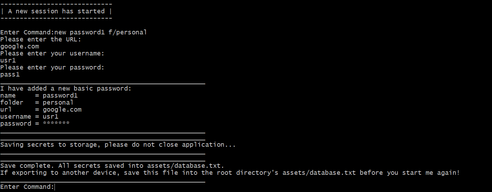 <br>
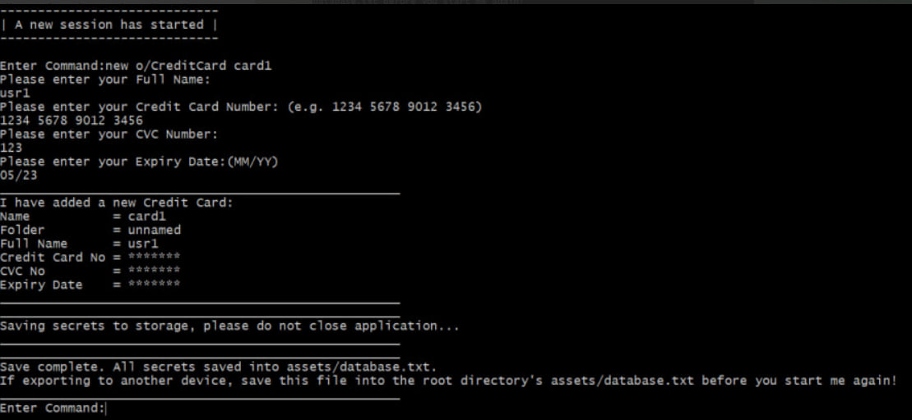

<table>                                                               
    <tr>                                                           
        <td> <a href="#table-of-contents">Click here for Table of Contents </a> </td>                                                            
        <td> <a href="#feature-list">Click here for Feature List </a> </td>                                                      
    </tr>                                                          
</table>  


### Delete a Secret
##### Overview
- Deletes a secret from the existing list of secrets using secret name. 

- Can delete multiple secrets in the same command.

- Each time an existing secret is deleted by the `delete` command, it will be auto-saved in `database.txt` in the 
`assets` folder. But users are advised to keep saving their passwords using the `save` command. Users can refer
[here](#save-secrets) for more details on the `save` command.

##### General Format: `delete SECRET_NAME1 [SECRET_NAME2] […]`

##### Examples and Outputs:
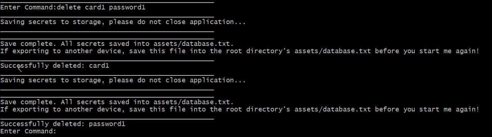

<table>                                                               
    <tr>                                                           
        <td> <a href="#table-of-contents">Click here for Table of Contents </a> </td>                                                            
        <td> <a href="#feature-list">Click here for Feature List </a> </td>                                                      
    </tr>                                                          
</table> 

### List all Secrets

##### Overview
- SecureNUS enables users to list secrets stored in a specified folder if the folder name is specified.

- It also enables users to list all the secrets if the folder name is not specified.

- Do note, secrets and other sensitive information are masked by asterisks for security purposes. They can be viewed
  using `view` command which will be elaborated upon [here](#view-masked-secret).

General Format: `list [f/FOLDER_NAME]`

Examples and Outputs:<br>
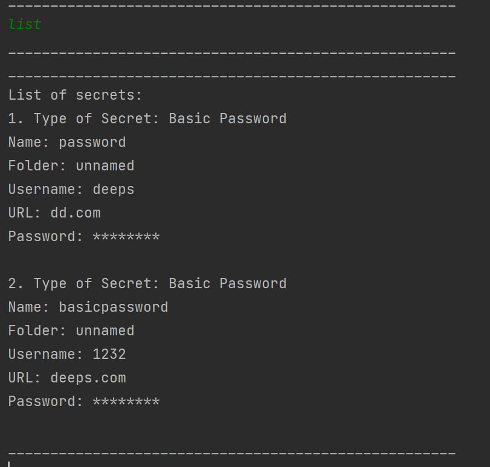  <br>
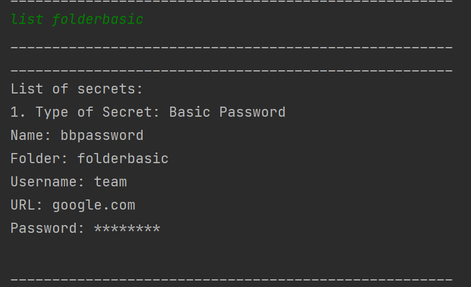
<br>

<table>                                                               
    <tr>                                                           
        <td> <a href="#table-of-contents">Click here for Table of Contents </a> </td>                                                            
        <td> <a href="#feature-list">Click here for Feature List </a> </td>                                                      
    </tr>                                                          
</table> 

### View Masked Secret

##### Overview
- When creating a new secret using the `new` command in SecureNUS or while listing the existing secrets using `list` 
command, the secret entered by the user is hidden under asterisks (********) for added security.

- This is a common practice in password management systems to prevent anyone from viewing the actual secrets.

- Users can view the original secret using the `view` command, which will display the secrets in plain text.

- It is important to exercise caution when using the `view` command, as anyone with access to the SecureNUS application
can view the secrets in plain text.

- Therefore, it is recommended to use SecureNUS on a secure and private device, and to take necessary precautions to 
prevent unauthorized access to the application.

##### General Format: `view SECRET_NAME`

##### Examples and Outputs: 
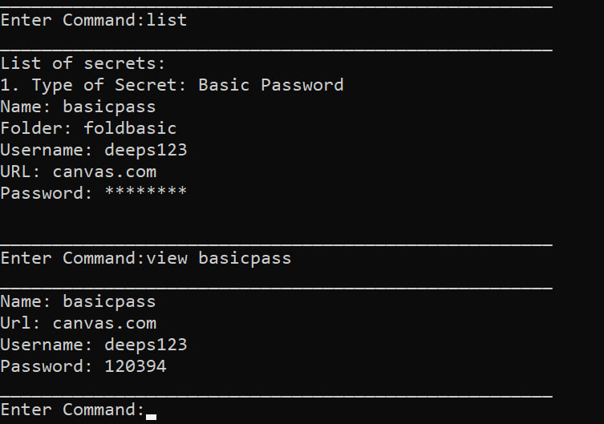


<table>                                                               
    <tr>                                                           
        <td> <a href="#table-of-contents">Click here for Table of Contents </a> </td>                                                            
        <td> <a href="#feature-list">Click here for Feature List </a> </td>                                                      
    </tr>                                                          
</table> 

### Search Secrets 
##### Overview
- SecureNUS allows users to search for stored secrets by using partial characters of the secret name but not that of 
the folder name.

- This feature helps users to quickly locate a specific secret in a large list of stored secrets.

- It is important to remember that secret names are case-sensitive, and users must enter the correct case of the secret 
name when searching.

- This search functionality is a convenient and time-saving feature for users who have many stored secrets and need to
locate a specific one quickly.

##### General Format: `search SECRET_NAME_LIKE [f/FOLDER_NAME]`

##### Examples and Outputs: 
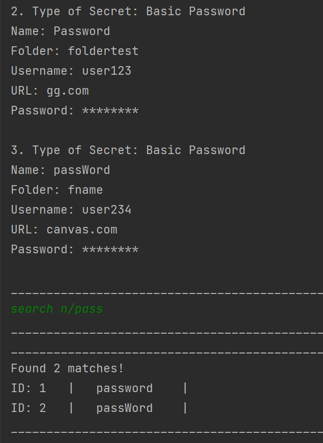 <br>
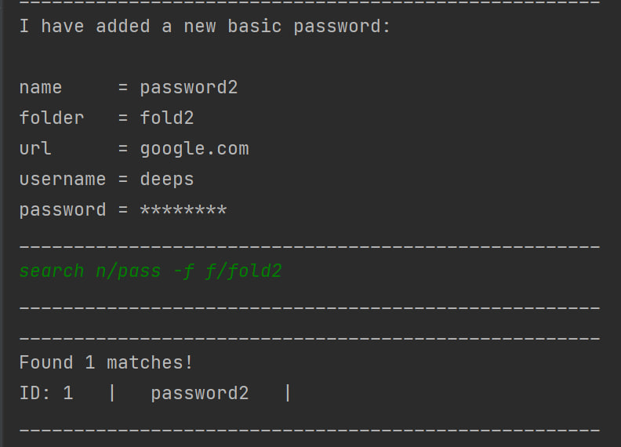 <br>
<br>

<table>                                                               
    <tr>                                                           
        <td> <a href="#table-of-contents">Click here for Table of Contents </a> </td>                                                            
        <td> <a href="#feature-list">Click here for Feature List </a> </td>                                                      
    </tr>                                                          
</table>

### Save Secrets
##### Overview
- SecureNUS allows to save a secret in the `database.txt` file located in the `assets` folder using the `save` 
command.

- The secrets will be saved even after exiting the program using the `exit` command. 

- In SecureNUS, if the `database.txt` file is not corrupted, users can view their saved secrets even after 
reloading the JAR file by running `java -jar [CS2113-T15-2][SecureNUS].jar` in the terminal.

- The `database.txt` file is used to store all secrets in a structured manner for easy retrieval and management.
- Each time a new secret is created using `new` command, delete a secret using `delete` command and edit a secret using
the `edit` command, the changes are automatically saved in the `database.txt` file.

- It is recommended that the users keep using the `save` command to store their secrets. 

##### Important Note
- Please refrain from manually editing or tampering the `database.txt` file as it may lead to data corruption. 

- To know if the database.txt is corrupted, exit from the current program run using the `exit` command and rerun the 
JAR file using `java -jar [CS2113-T15-2][SecureNUS].jar` and observe the following in the UI: 

<table>
    <tr>
        <td> S.no</td>
        <td> UI on re-running the JAR file </td>
        <td> Description </td>
    </tr>
    <tr>
        <td> 1. </td>
        <td> 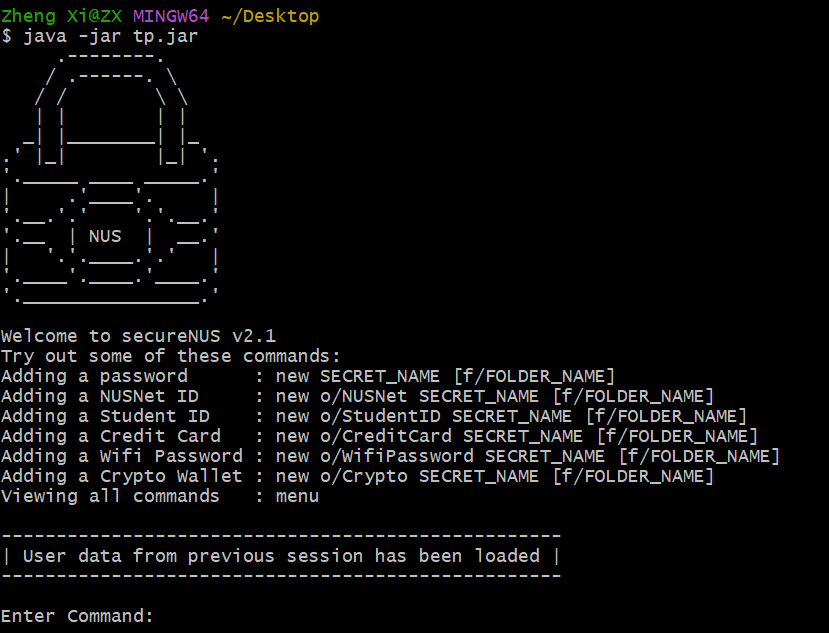 </td>
        <td>
            <ul>
                <li> The secrets from the previous sessions are stored correctly. </li>
                <li> The <code> database.txt </code> file is not corrupted.</li>
            </ul>
        </td>
    </tr>
    <tr>
        <td> 2. </td>
        <td>
            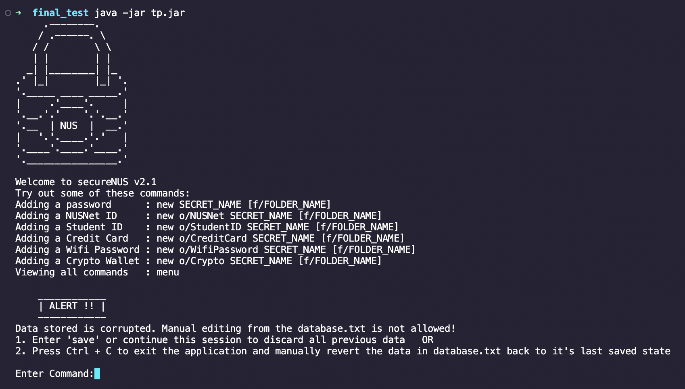
        </td>
        <td>
            <ul>
                <li> The secrets from the previous sessions may not be stored correctly. </li>
                <li> The <code> database.txt </code> file is corrupted.</li>
            </ul>
        </td>
    </tr>
</table>

* In case of `2.`, users can follow 2 troubleshooting steps: 
  * Recommended: Users can use the `save` command OR continue using the app as per normal. 
All previous data will be erased when new data is loaded in. 
  * Try to recover the state of `database.txt` by using the `Ctrl + Z` shortcut. You may have accidentally 
edited some characters in the `database.txt` file causing the corruption. 
In such cases, undoing these edits by using the `Ctrl + Z` shortcuts will cause the application to import the 
previous data on next load.
  
##### General Format: `save`

##### Examples and Outputs: <br>
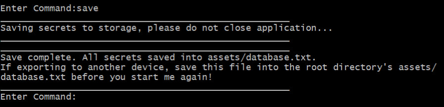
<br>

<table>                                                               
    <tr>                                                           
        <td> <a href="#table-of-contents">Click here for Table of Contents </a> </td>                                                            
        <td> <a href="#feature-list">Click here for Feature List </a> </td>                                                      
    </tr>                                                          
</table>

### Edit Secrets
##### Overview
- SecureNUS enables users to edit an existing secret using the `edit` command.

- By using the `edit` command, users can make changes to a secret without having to delete it and create a new one.

- It is important to note that secret names are case-sensitive and must be entered correctly in order to edit the 
associated secret.

##### General Format: `edit SECRET_NAME`

##### Examples and Outputs: 
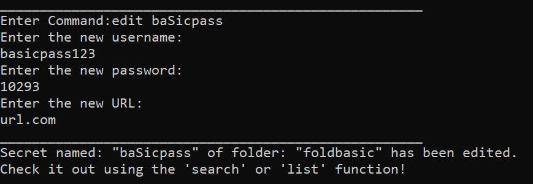
<br>

<table>                                                               
    <tr>                                                           
        <td> <a href="#table-of-contents">Click here for Table of Contents </a> </td>                                                            
        <td> <a href="#feature-list">Click here for Feature List </a> </td>                                                      
    </tr>                                                          
</table>

### Menu
##### Overview
- In SecureNUS, the menu command displays a list of available commands that users can access from the 
command line interface.

- This feature is useful for new users who may be unfamiliar with the available commands and need a quick reference.

- The menu command also provides a convenient way for users to access specific commands 
without having to remember their syntax or name.

##### General Format: `menu`

Examples and Outputs: <br>
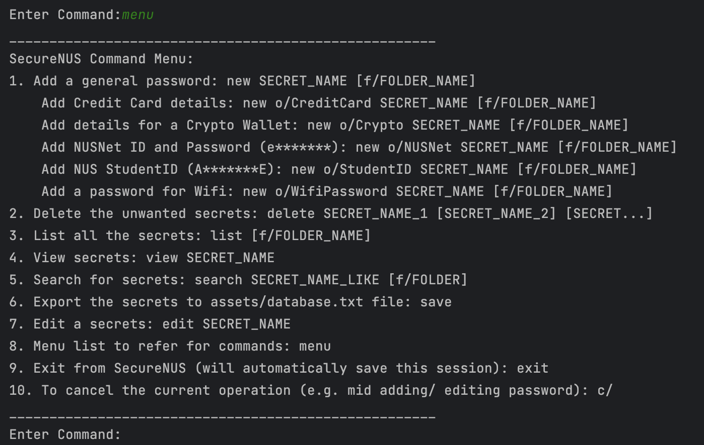
<br>

<table>                                                               
    <tr>                                                           
        <td> <a href="#table-of-contents">Click here for Table of Contents </a> </td>                                                            
        <td> <a href="#feature-list">Click here for Feature List </a> </td>                                                      
    </tr>                                                          
</table>

### Exit
##### Overview
- In SecureNUS, the exit command is used to terminate the program and exit the command line interface.

- This command is useful for users who are finished using the application and wish to close it without having to close 
the entire command prompt or terminal.
- If the `database.txt` file is not corrupted, the `exit` command will save the current list of secrets. 

##### General Format: `exit`

##### Examples and Outputs: <br>
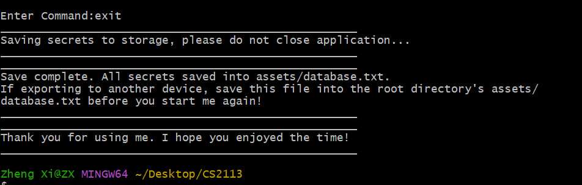
<br>

<table>                                                               
    <tr>                                                           
        <td> <a href="#table-of-contents">Click here for Table of Contents </a> </td>                                                            
        <td> <a href="#feature-list">Click here for Feature List </a> </td>                                                      
    </tr>                                                          
</table>


### Cancel current operation
##### Overview
- The `c/` command allows users to cancel the current operation in SecureNUS. 
This can be useful in situations where the user has started an operation, but realizes that they need to abort it 
before it is complete.

- To cancel the current operation, simply type `c/` followed by the Enter key. SecureNUS will immediately terminate the 
current operation and return the user to the main command prompt.

- Note that cancelling an operation may result in data loss or other unintended consequences, depending on the specific 
operation being performed. It is recommended that users use the `c/` command only when absolutely necessary and that 
they save their data frequently to avoid losing any unsaved changes.

##### General Format: `c/`

##### Examples and Outputs: <br>
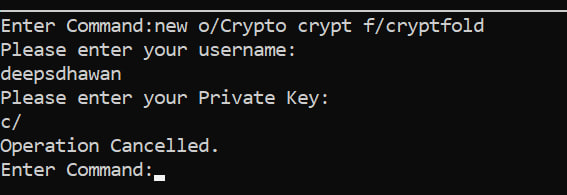
<br>
<table>                                                               
    <tr>                                                           
        <td> <a href="#table-of-contents">Click here for Table of Contents </a> </td>                                                            
        <td> <a href="#feature-list">Click here for Feature List </a> </td>                                                      
    </tr>                                                          
</table> 
<br>

## Frequently Asked Questions

**Q:** How does SecureNUS store my secrets?<br>
**A:** SecureNUS stores your secrets in a structured format in the `database.txt` file located in the `assets` folder. 
The secrets are stored securely to ensure that your sensitive information is protected.

<br>

**Q:** What is the difference between a basic password and other password options?<br>
**A:** A basic password is a simple password that only requires a password name and password value to be entered. Other 
password options provide additional fields for specific types of passwords, such as credit cards or NUSNet ID.

<br>

**Q:** What if I create a secret without a folder?<br>
**A:** Secret will assign itself in an `unnamed` folder.

<br>

**Q:** What should I do if I forget my secret for SecureNUS?<br>
**A:** You can use the `list` command to view the details of the all the secrets you stored. Do note that the 
sensitive information is masked to ensure security and can be viewed by using the `view` command.

<br>

**Q:** How can I ensure the security of my secrets in SecureNUS?<br>
**A:** At SecureNUS, we strive to keep the secrets of the users secure. Keeping this in consideration, we mask 
sensitive information using asterisks when the user creates a new secret using `new` command or list the secrets using 
`list` command. 

<br>

**Q:** Can I export my secrets stored in SecureNUS to another device?<br>
**A:** Yes, you can export your secrets to another device by opening the same JAR file in another machine. 
Do ensure to save `database.txt` in the root directory's `assets/database.txt`
As a user, you ou can ensure the security of your secrets in SecureNUS by using strong and unique secrets, 
keeping your secrets private and secure, and regularly updating your secrets.

<br>

**Q:** Will all the key commands native to the command line work eg. `Ctrl-C` for program termination, `Ctrl-V` for 
paste, `Up arrow` to move to previous commands e.t.c.?<br>
**A:** The functionality for the key operations differ between terminals and operating systems. To avoid any unknown 
errors and exceptions, users are requested to refrain from using the key shortcuts especially the `Ctrl+C` shortcut 
which may lead to termination of the program.

<br>

**Q:** I forgot to save before exiting. Are all my secrets lost?<br>
**A:** SecureNUS realizes the importance of keeping the passwords safe and secure. So we ensure that the secrets added 
are stored conveniently.
* Each time a new secret is added using `new` command, deleted using `delete` command or edited using `edit` command,
it is automatically saved in the `database.txt` file in the `assets` folder. 
* On exiting the program using the `exit` command, SecureNUS will save all the secrets in 
the `database.txt` file.
* Users have an option to keep saving their secrets using the `save` command.
In general, until and unless user does not cancel their operation using the `c/` command, all secrets will be saved in 
the `database.txt` file in the `asset` folder. But users are requested to keep saving their file using the `save` 
command. 

<br>

**Q:** How can I report a bug or issue with SecureNUS? <br>
**A:** You can report a bug or issue with SecureNUS by raising an issue in the issue tracker of the team's
[Github Repo](https://github.com/AY2223S2-CS2113-T15-2/tp/issues).
Please attach the screenshots of the issues/bugs and the log files (`assets/logFiles.txt`) for us to better understand 
and trace the origin of the issue.<br>
Alternatively, you can also contact the 
[developers](AboutUs.md) of SecureNUS. 


<table>                                                               
    <tr>                                                           
        <td> <a href="#table-of-contents">Click here for Table of Contents </a> </td>
    </tr>                                                          
</table>

## Command Summary
<table>
    <tr>
        <td>Action </td>
        <td>Format/Examples </td>
    </tr>
    <tr>
        <td>New </td>
        <td><code>new [o/OPTION] SECRET_NAME [f/FOLDER_NAME] </code> </td>
    </tr>
    <tr>
        <td>Delete</td>
        <td><code>delete SECRET_NAME1 [SECRET_NAME2] [...] </code></td>
    </tr>
    <tr>
        <td>List</td>
        <td><code>list [f/FOLDER_NAME]</code></td>
    </tr>
    <tr>
        <td>View </td>
        <td><code>view SECRET_NAME</code></td>
    </tr>
    <tr>
        <td>Search</td>
        <td><code>search SECRET_NAME_LIKE [f/FOLDER_NAME]</code></td>
    </tr>
    <tr>
        <td>Save</td>
        <td><code>save</code></td>
    </tr>
    <tr>
        <td>Edit</td>
        <td><code> edit SECRET_NAME </code></td>
    </tr>
    <tr>
        <td>Menu</td>
        <td><code>menu</code></td>
    </tr>
    <tr>
        <td> Exit </td>
        <td> <code>exit</code></td>
    </tr>
    <tr>
        <td> Cancel </td>
        <td> <code> c/ </code></td>
    </tr>
</table>

<table>
    <tr>
        <td> <a href="#table-of-contents">Click here for Table of Contents </a> </td>
    </tr>
</table>
